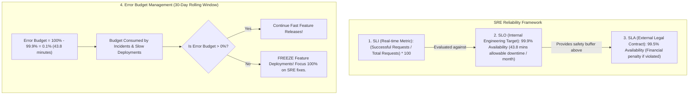

# SRE Reliability Targets: SLIs, SLOs, SLAs, and Error Budgets

---

## 1. What Is It?
In **Site Reliability Engineering (SRE)** and production backend operations:
- **SLI (Service Level Indicator)**: A quantifiable, real-time measurement of service behavior (e.g. *HTTP 2xx Success Rate* or *p99 Response Latency*).
- **SLO (Service Level Objective)**: A target reliability threshold agreed upon by engineering and product teams (e.g. *$99.9\%$ of successful requests over a rolling 30-day window*).
- **SLA (Service Level Agreement)**: A formal legal contract with external customers that triggers financial compensation or service credits if broken (e.g. *$99.5\%$ uptime or 10% invoice refund*).
- **Error Budget**: The mathematical fraction of unreliability permitted by the SLO ($1 - \text{SLO}$), representing the innovation budget for deployments.

---

## 2. Why Does It Exist?
- **The $100\%$ Uptime Fallacy**: Attempting to achieve $100\%$ availability is economically impossible and halts all engineering velocity (you can never deploy code or run updates).
- **Resolving Product vs SRE Conflict**: The **Error Budget** provides an objective mathematical policy:
  - If the Error Budget is **Healthy ($> 20\%$)** $\longrightarrow$ Product teams ship features rapidly.
  - If the Error Budget is **Exhausted ($0\%$)** $\longrightarrow$ Feature deployments are **frozen**, and all engineering resources pivot to reliability, testing, and infrastructure stabilization.

---

## 3. Mental Model: The SLI, SLO, SLA, and Error Budget Hierarchy



---

## 4. How Does It Work?

### 1. The High Availability ("Nines") Calculus

| Availability SLO | Permitted Downtime / Year | Permitted Downtime / Month | Permitted Downtime / Day | Engineering Complexity |
|---|---|---|---|---|
| **$99.0\%$ (2 Nines)** | $3.65\text{ days}$ | $7.31\text{ hours}$ | $14.4\text{ minutes}$ | Single Server / Basic Backup |
| **$99.9\%$ (3 Nines - Standard)** | **$8.77\text{ hours}$** | **$43.8\text{ minutes}$** | **$1.44\text{ minutes}$** | **Multi-AZ / Auto-Scaling** |
| **$99.99\%$ (4 Nines - Enterprise)** | **$52.6\text{ minutes}$** | **$4.38\text{ minutes}$** | **$8.64\text{ seconds}$** | **Multi-Region Active-Active** |
| **$99.999\%$ (5 Nines - Mission Critical)** | **$5.26\text{ minutes}$** | **$26.3\text{ seconds}$** | **$0.86\text{ seconds}$** | **Zero-Downtime Autonomous Mesh** |

---

### 2. SLI Formulation (The Good / Total Ratio)

$$\text{SLI} = \frac{\text{Count of 'Good' Events}}{\text{Count of 'Total' Valid Events}} \times 100\%$$

#### Standard Production SLIs:
1. **Availability SLI**: $\frac{\text{HTTP Status } < 500}{\text{Total HTTP Requests}}$
2. **Latency SLI**: $\frac{\text{Requests with Latency } < 250\text{ms}}{\text{Total Valid Requests}}$
3. **Freshness SLI**: $\frac{\text{Kafka Events Processed with Lag } < 5\text{s}}{\text{Total Published Events}}$

---

## 5. Implementation: Prometheus PromQL for Availability SLO Calculation

```promql
# 1. 30-Day Rolling Window Availability SLI (Payment Service)
sum(rate(http_server_requests_seconds_count{status!~"5..", uri="/api/v1/payments"}[30d]))
/
sum(rate(http_server_requests_seconds_count{uri="/api/v1/payments"}[30d]))
* 100

# 2. 1-Hour Multi-Window Error Budget Burn Rate (Alert if burning budget 14.4x faster than expected)
(
  sum(rate(http_server_requests_seconds_count{status=~"5..", uri="/api/v1/payments"}[1h]))
  /
  sum(rate(http_server_requests_seconds_count{uri="/api/v1/payments"}[1h]))
) > (1 - 0.999) * 14.4
```

---

## 6. Performance & Operational Impact

| Error Budget Status | Deployment Policy | Testing & Quality Gate | SRE Priority |
|---|---|---|---|
| **$> 50\%$ Remaining** | Normal continuous deployment | Standard automated CI/CD | Feature support |
| **$10\% - 50\%$ Remaining** | Canary deployments required | Stricter integration tests | Performance tuning |
| **$\mathbf{\le 0\%}$ (Exhausted)** | **Production Deployment Freeze** | **Mandatory RCA Sign-off** | **100% Dedicated to Reliability** |

---

## 7. Interview Questions

### Q1: Why should an internal engineering SLO always be significantly stricter than an external customer-facing SLA?
<details>
<summary>Reveal Answer</summary>

**Answer**:
1. **Safety Margin / Defense-in-Depth**:
   - If a company promises customers a $99.5\%$ SLA, the internal engineering team should target a $99.9\%$ SLO.
   - The gap between $99.9\%$ ($43.8\text{ mins downtime/month}$) and $99.5\%$ ($219.2\text{ mins downtime/month}$) represents a **$175.4\text{-minute Safety Buffer}$**.
2. **Early Internal Alerting**:
   - If a service begins failing, the internal SLO alerts fire when the team burns past $99.9\%$.
   - SREs have hours to triage, investigate, and remediate the issue **before the customer-facing SLA is ever breached**, completely avoiding customer refunds, breach of contract penalties, and public reputational damage.
</details>

---

## 8. Quick Revision
- **SLI**: Real-time measurement ($\text{Good Events} / \text{Total Events}$).
- **SLO**: Internal engineering target ($99.9\%$).
- **SLA**: External legal agreement ($99.5\%$) with financial penalties.
- **Error Budget**: $1 - \text{SLO}$; the allowable room for experimentation and failures.
- **Error Budget Policy**: Freeze feature releases when the budget hits 0%.
