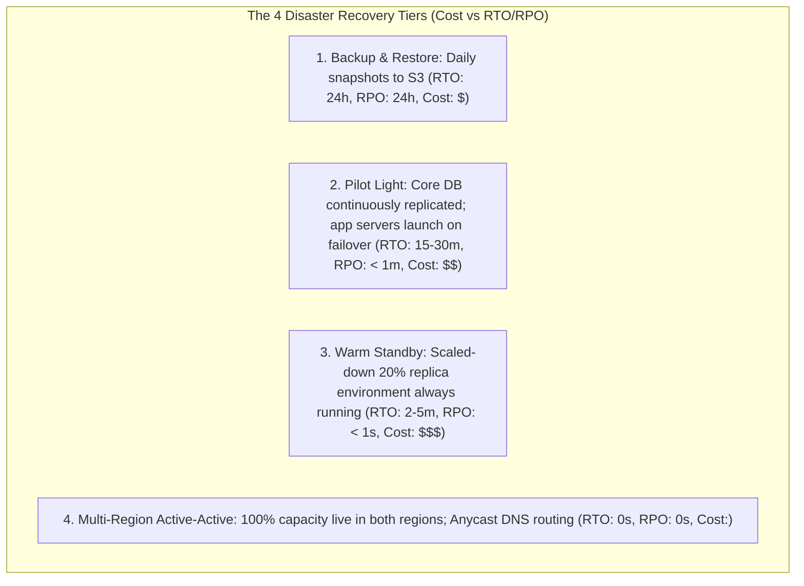

# Disaster Recovery: RTO, RPO, and Multi-Region Architectures

---

## 1. What Is It?
**Disaster Recovery (DR)** is the architectural, operational, and organizational capability of an enterprise backend platform to restore critical services, database consistency, and application workloads following a catastrophic regional failure (e.g. AWS datacenter fire, hurricane, major fiber cut, or statewide power loss).

The two defining metrics of Disaster Recovery are:
1. **RTO (Recovery Time Objective)**: The maximum acceptable duration of system downtime from incident onset to full operational recovery ($t_{\text{recovery}} - t_{\text{incident}}$).
2. **RPO (Recovery Point Objective)**: The maximum acceptable volume of data loss measured in time ($t_{\text{incident}} - t_{\text{last valid backup}}$).

---

## 2. Mental Model: RTO vs RPO

```text
Time Line:
--------------------------------------------------------------------------------------->
       |                                      |                                  |
   Last Valid                              Disaster                          Application
 Database Backup                            Strikes                            Restored
       |                                      |                                  |
       |<------------ RPO ------------------->|<------------- RTO -------------->|
       |     (Acceptable Data Loss)           |     (Acceptable Downtime)        |
```

---

## 3. The 4 Cloud Disaster Recovery Strategies Compared



---

## 4. Deep Dive: The 4 Disaster Recovery Tiers

| Strategy | RTO (Downtime) | RPO (Data Loss) | Cost Factor | How It Works |
|---|---|---|:---:|---|
| **1. Backup & Restore** | $12 - 24\text{ Hours}$ | $12 - 24\text{ Hours}$ | $\$$ (Cheapest) | Data backed up periodically to S3 Glacier; restored manually upon disaster. |
| **2. Pilot Light** | $15 - 30\text{ Minutes}$ | $\mathbf{< 1\text{ Minute}}$ | $\$ \$$ | Database actively replicates to DR region; application pods scaled to 0 until failover. |
| **3. Warm Standby** | $\mathbf{2 - 5\text{ Minutes}}$ | $\mathbf{< 1\text{ Second}}$ | $\$ \$ \$$ | Scaled-down mini-cluster runs in DR region; auto-scales to $100\%$ on DNS failover. |
| **4. Multi-Region Active-Active** | **$\mathbf{0\text{ Seconds}}$ (Instant)**| **$\mathbf{0\text{ Seconds}}$** | $\$ \$ \$ \$$ (Highest) | Full production capacity live in US-East and US-West; traffic dynamically balanced. |

---

## 5. Multi-Region Database Topologies

### 1. Active-Passive Multi-Region (Amazon Aurora Global Database)
- **Primary Region (US-East)**: Handles $100\%$ of writes and local reads.
- **Secondary Region (US-West)**: Dedicated storage-layer physical replication channel replicates WAL logs across regions in **$< 1\text{ second}$**.
- **Disaster Failover**: If US-East goes dark, Route 53 Health Checks promote the US-West replica to primary in **$< 1\text{ minute}$**.

```mermaid
flowchart LR
    Users["Global Users"] --> Route53["Route 53 DNS Failover"]
    
    subgraph PrimaryRegion["Primary Region: US-East-1 (Active)"]
        ALB1["ALB"] --> App1["Spring Boot Pods"]
        App1 --> AuroraPrimary[("Aurora Primary (Writer)")]
    end

    subgraph SecondaryRegion["DR Region: US-West-2 (Standby)"]
        ALB2["ALB Standby"] --> App2["Spring Boot Pods (Standby)"]
        AuroraReplica[("Aurora Global Replica (Reader)")]
    end

    Route53 -->|100% Traffic| ALB1
    Route53 -.->|Failover on Health Check Failure| ALB2
    AuroraPrimary -->|Storage-Level Async Replication (< 1s)| AuroraReplica
```

---

### 2. Multi-Region Active-Active & Split-Brain Hazards
In true Active-Active setups (writes accepted in *both* regions simultaneously):
- **The Split-Brain Disaster**: If the transatlantic network cable severs, both regions continue accepting writes to the same customer balance independently.
- **Resolution**: Requires globally distributed consensus databases (**Google Cloud Spanner / CockroachDB / Amazon DynamoDB Global Tables**) with automated **Conflict Resolution (Last-Write-Wins or CRDTs)**.

---

## 6. Implementation: Route 53 DNS Health Check Failover in Terraform

```hcl
# 1. Primary Endpoint Health Check
resource "aws_route53_health_check" "primary_health" {
  fqdn              = "api-us-east.company.com"
  port              = 443
  type              = "HTTPS"
  resource_path     = "/actuator/health/readiness"
  failure_threshold = 3
  request_interval  = 10 # Check every 10 seconds
}

# 2. Failover DNS Routing Policy
resource "aws_route53_record" "api_endpoint" {
  zone_id = "Z1234567890"
  name    = "api.company.com"
  type    = "A"

  # Primary Record (US-East-1)
  failover_routing_policy {
    type = "PRIMARY"
  }
  set_identifier  = "primary-us-east"
  health_check_id = aws_route53_health_check.primary_health.id
  alias {
    name                   = aws_lb.us_east_alb.dns_name
    zone_id                = aws_lb.us_east_alb.zone_id
    evaluate_target_health = true
  }
}

# Secondary Failover Record (US-West-2)
resource "aws_route53_record" "api_endpoint_dr" {
  zone_id = "Z1234567890"
  name    = "api.company.com"
  type    = "A"

  failover_routing_policy {
    type = "SECONDARY"
  }
  set_identifier = "secondary-us-west"
  alias {
    name                   = aws_lb.us_west_alb.dns_name
    zone_id                = aws_lb.us_west_alb.zone_id
    evaluate_target_health = true
  }
}
```

---

## 7. Performance & Cost Trade-Off Matrix

| Strategy | Target RTO | Target RPO | Monthly Cloud Cost |
|---|---|---|:---:|
| Backup & Restore | $24\text{h}$ | $24\text{h}$ | $+5\%$ |
| Pilot Light | $20\text{m}$ | $< 1\text{m}$ | $+30\%$ |
| Warm Standby | $3\text{m}$ | $< 1\text{s}$ | $+60\%$ |
| **Multi-Region Active-Active** | **$0\text{s}$** | **$0\text{s}$** | **$+150\%$** |

---

## 8. Interview Questions

### Q1: What is the difference between RTO and RPO, and how do they dictate the choice between a Pilot Light and an Active-Active multi-region architecture?
<details>
<summary>Reveal Answer</summary>

**Answer**:
1. **Definitions**:
   - **RTO (Recovery Time Objective)**: The maximum acceptable time to get systems running again after an outage (e.g. *Can we tolerate 30 minutes of downtime?*).
   - **RPO (Recovery Point Objective)**: The maximum acceptable amount of data loss resulting from an outage (e.g. *Can we tolerate losing the last 5 minutes of data?*).
2. **Architecture Selection**:
   - If business requirements specify **$\text{RTO} \le 30\text{ mins}$ and $\text{RPO} \le 1\text{ min}$**, a **Pilot Light** architecture is optimal: databases replicate in real time, while application pods remain at zero replicas until an outage occurs, keeping infrastructure costs low ($+30\%$).
   - If business requirements specify **$\text{RTO} \approx 0$ and $\text{RPO} \approx 0$** (e.g. core payment processing or stock exchanges), a **Multi-Region Active-Active** architecture is mandatory: full application clusters and multi-master databases run in both regions simultaneously, accepting traffic dynamically at higher financial and operational cost ($+150\%$).
</details>

---

## 9. Quick Revision
- **RTO**: Allowable downtime ($t_{\text{restore}} - t_{\text{incident}}$).
- **RPO**: Allowable data loss ($t_{\text{incident}} - t_{\text{backup}}$).
- **Pilot Light**: DB replicates continuously; app servers launch only during failover.
- **Warm Standby**: Mini-cluster runs continuously; scales up on DNS switch.
- **Active-Active**: Full capacity runs in multiple regions; zero downtime failover.
- **Route 53 Failover**: Automates DNS routing based on health checks.
