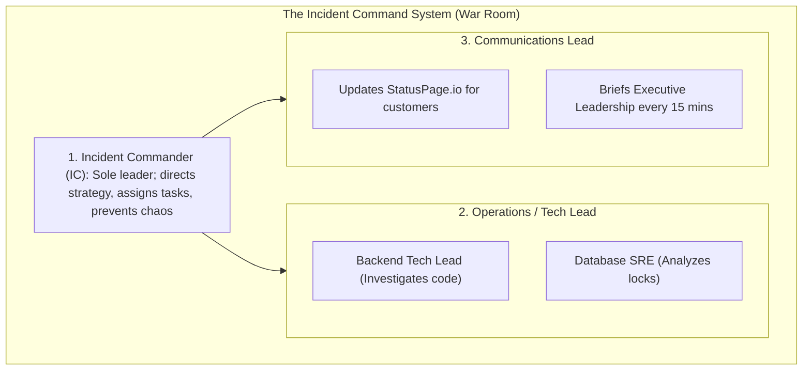

# Incident Management, On-Call Hygiene, and Blameless Postmortems

---

## 1. What Is It?
**Incident Management** is the structured, repeatable operational process by which software engineering organizations detect, triage, mitigate, and resolve production service disruptions.

A **Blameless Postmortem (Root Cause Analysis / RCA)** is a collaborative retrospective conducted after an incident that investigates the systemic, architectural, and procedural vulnerabilities that permitted the failure to occur, without assigning personal blame to individual engineers.

---

## 2. Why Does It Exist?
- **Chaotic War Rooms**: Without established roles, 20 engineers jump into a debugging call simultaneously, shouting over each other, applying contradictory ad-hoc database updates, and making the outage worse.
- **The Culture of Fear (Blaming Individuals)**: If an organization punishes engineers for making mistakes (e.g. *"Alice caused the outage because she made a typo"*), engineers will hide failures, delay alerting on-call responders, and avoid touching risky legacy code.
- **Blameless Postmortems**: Assume that **every engineer acted in good faith with the information available to them**. The goal is to fix the *system* (e.g. *"Why did our CI pipeline allow a typo to reach production without validation?"*).

---

## 3. Mental Model: Incident Command System (ICS) Roles



---

## 4. How Does It Work?

### 1. Production Severity Classification Levels

| Severity | Definition | Customer Impact | Target Response SLA |
|---|---|---|:---:|
| **SEV-1 (Critical)** | Core critical service down; revenue/payments halted globally | All / Majority of users | **$< 5\text{ minutes}$ (24/7 Page)** |
| **SEV-2 (Major)** | Major feature broken; degradation with no workaround | Significant subset of users | **$< 15\text{ minutes}$ (24/7 Page)** |
| **SEV-3 (Minor)** | Non-critical feature broken; workaround available | Minor subset of users | Business hours |
| **SEV-4 (Low)** | Cosmetic UI glitch or internal tool defect | Zero customer impact | Next Sprint backlog |

---

### 2. The 5 Whys Root Cause Analysis (RCA) Methodology

$$\textbf{Example Incident: } \text{Payment Service crashed for 45 minutes during Black Friday.}$$

1. **Why did the Payment Service crash?**
   $\longrightarrow$ Because the database connection pool was completely exhausted.
2. **Why was the connection pool exhausted?**
   $\longrightarrow$ Because worker threads were blocked for 30 seconds on an unindexed SQL query.
3. **Why was the SQL query unindexed?**
   $\longrightarrow$ Because a new query was added in yesterday's release without an accompanying database migration.
4. **Why did CI/CD allow an unindexed query to deploy to production?**
   $\longrightarrow$ Because integration tests ran against a test database with only 10 rows, where queries execute in $0.1\text{ms}$ even without indexes.
5. **Why were performance test gates missing in the pipeline?**
   $\longrightarrow$ **ROOT CAUSE**: The CI/CD pipeline lacked automated `EXPLAIN ANALYZE` query plan validation and realistic synthetic dataset load testing before production promotion.

---

## 5. Production Blameless Postmortem Template

```markdown
# Incident Postmortem: Payment Gateway Connection Pool Exhaustion

**Date:** 2026-09-01  
**Severity:** SEV-1  
**Incident Commander:** Sourav Saha  
**Duration:** 42 Minutes (14:15 UTC - 14:57 UTC)  
**Customer Impact:** ~18,500 checkout transactions failed (HTTP 500). Total lost GMV: ~$42,000.

---

## 1. Executive Summary
Between 14:15 UTC and 14:57 UTC, the Payment Microservice experienced a 100% outage due to HikariCP connection pool starvation triggered by an unindexed query scanning 12M rows in the `orders` table. The issue was mitigated by rolling back Deployment v2.4.1.

---

## 2. Incident Timeline (All times in UTC)
- **14:00** - Deployment v2.4.1 completed successfully.
- **14:15** - PagerDuty fires SEV-1 alert: *Payment P99 Latency > 1000ms*.
- **14:18** - Incident Commander initiates War Room; designates Comms Lead.
- **14:23** - Database SRE identifies 50 connections stuck on `SELECT * FROM orders WHERE tracking_number = ...`.
- **14:32** - IC orders immediate traffic rollback to Blue environment (v2.4.0).
- **14:45** - Rollback completes; connection pool recovers.
- **14:57** - Error rates return to 0.0%; incident closed.

---

## 3. Root Cause Analysis (5 Whys)
- An unindexed query was added in v2.4.1 that performed sequential table scans under load.
- Staging environments lacked volume data, so automated tests failed to catch the slow scan.

---

## 4. Preventative Action Items (Tracking in JIRA)
| Action Item | Priority | Assignee | Target Date |
|---|---|---|---|
| Add B+Tree index on `orders(tracking_number)` | P0 | Backend Team | 2026-09-02 |
| Add CI check enforcing `EXPLAIN` query plan analysis for all new SQL queries | P1 | DevOps Team | 2026-09-10 |
| Configure HikariCP `leakDetectionThreshold: 5000ms` | P1 | SRE Team | 2026-09-05 |
```

---

## 6. Performance & Culture Comparison

| Metric / Dimension | Blame-Oriented Culture | Blameless SRE Culture |
|---|---|---|
| **Mean Time to Detect (MTTD)** | High (Engineers delay reporting mistakes) | **Low (Engineers immediately escalate)** |
| **Systemic Fixes Generated** | Low (*"Told developer to be more careful"*) | **High (Automated CI gates & alarms)** |
| **On-Call Engineer Attrition** | High (Burnout & fear) | **Low (Psychological safety & trust)** |

---

## 7. Interview Questions

### Q1: Why is a blameless postmortem culture critical for maintaining high-availability distributed systems?
<details>
<summary>Reveal Answer</summary>

**Answer**:
1. **Psychological Safety & Transparency**:
   - In complex distributed systems, human error is inevitable. When an organization punishes individuals for outages, engineers naturally hide mistakes, silence warning signs, and delay escalating critical alerts to protect their jobs.
   - In a **Blameless Culture**, engineers openly share what went wrong immediately, enabling the fastest possible triage and recovery.
2. **Focus on Systemic Architecture**:
   - Blaming an individual is a dead end that leaves the underlying vulnerability unpatched.
   - Blameless postmortems assume that any human in the same situation would make the same mistake. This forces the engineering team to build **automated safeguards** (e.g. CI/CD test gates, canary rollouts, automated rollbacks, and IAM least-privilege guardrails) that make it structurally impossible for that class of failure to ever occur again.
</details>

---

## 8. Quick Revision
- **Incident Commander (IC)**: Single point of command directing triage and strategy.
- **Severity Tiers**: SEV-1 (Critical revenue loss) down to SEV-4 (Cosmetic).
- **5 Whys**: Progressive questioning technique to uncover fundamental root causes.
- **Blameless Culture**: Investigates systemic flaws rather than punishing individuals.
- **Action Items**: Postmortems must result in tracked, assigned preventative JIRA tickets.
