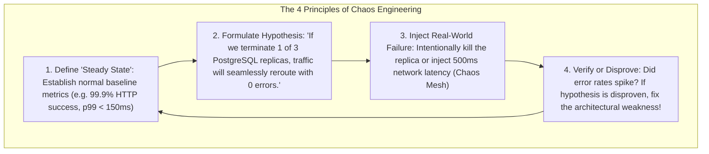

# Production Runbooks and Chaos Engineering: Building Resilient Systems

---

## 1. What Is It?
- **Production Runbook (Playbook / Standard Operating Procedure - SOP)**: A structured, step-by-step diagnostic and remediation guide designed to help on-call engineers quickly triage, mitigate, and resolve specific production alerts under high stress at 3:00 AM.
- **Chaos Engineering**: The disciplined practice of intentionally injecting controlled, synthetic failures (killing pods, severing network links, simulating packet loss, corrupting disk I/O) into staging and production systems to proactively identify and fix resilience weaknesses before they cause real customer outages.

---

## 2. Why Does It Exist?
- **The 3:00 AM On-Call Nightmare**: When an on-call engineer is woken up by a PagerDuty alarm, cognitive performance drops. Searching through Slack logs or guessing diagnostic commands causes extended downtime. **Runbooks provide clear, executable commands with zero guesswork**.
- **Unverified Resilience**: An architecture team can spend 6 months designing an automated failover system, but unless it is continuously tested with **Chaos Engineering**, the failover logic will fail during a real disaster due to a hidden configuration drift or timeout mismatch.

---

## 3. The 4 Principles of Chaos Engineering (Netflix Model)



---

## 4. The 4 Mission-Critical Production Runbooks

---

### Runbook 1: Database Connection Pool Exhaustion (HikariCP)

#### 1. Symptoms & Alert
- **Alert**: `HikariPool-1 - Connection is not available, request timed out after 30000ms.`
- **Customer Impact**: API requests hanging for 30s and returning HTTP 504 Gateway Timeout.

#### 2. Triage Commands
```bash
# Check active connections and long-running locking queries in PostgreSQL
SELECT pid, age(clock_timestamp(), query_start), usename, state, query 
FROM pg_stat_activity 
WHERE state != 'idle' 
ORDER BY age(clock_timestamp(), query_start) DESC 
LIMIT 10;
```

#### 3. Immediate Mitigation Steps
1. **Terminate Blocked / Rogue Query**:
   ```sql
   SELECT pg_terminate_backend(<pid_of_slow_query>);
   ```
2. **Restart Leaking Application Pods**:
   ```bash
   kubectl rollout restart deployment payment-service -n production
   ```

---

### Runbook 2: Kafka Consumer Lag Surge

#### 1. Symptoms & Alert
- **Alert**: `KafkaConsumerLagHigh > 50,000 records for 10 minutes`.
- **Customer Impact**: Invoices or notification emails delayed by hours.

#### 2. Triage Commands
```bash
# Check lag per partition
kafka-consumer-groups.sh --bootstrap-server kafka:9092 --describe --group invoice-processing-group
```

#### 3. Immediate Mitigation Steps
1. **Check for Poison Pill / Worker Crash**:
   ```bash
   kubectl logs -n production -l app=invoice-worker --tail=200 | grep -i "error"
   ```
2. **Scale Out Worker Replicas** (Up to the total number of Kafka partitions):
   ```bash
   kubectl scale deployment invoice-worker -n production --replicas=16
   ```

---

### Runbook 3: JVM High CPU & Thread Pool Saturation

#### 1. Symptoms & Alert
- **Alert**: `ContainerCPUUtilization > 95% for 5 minutes`.

#### 2. Triage Commands
```bash
# Capture top CPU-consuming thread IDs inside container
kubectl exec -it <pod-name> -n production -- top -H -b -n 1 | head -n 20

# Capture on-demand thread dump using jcmd
kubectl exec -it <pod-name> -n production -- jcmd 1 Thread.print > /tmp/threaddump.txt
```

#### 3. Immediate Mitigation Steps
1. Scale up deployment capacity immediately to absorb traffic:
   ```bash
   kubectl scale deployment order-service -n production --replicas=10
   ```
2. Inspect `threaddump.txt` for `BLOCKED` threads or regular expression catastrophic backtracking loops.

---

### Runbook 4: Kubernetes Node Disk Full (`DiskPressure: true`)

#### 1. Symptoms & Alert
- **Alert**: `KubeletHasDiskPressure`. Pods transitioning to `Evicted` status.

#### 2. Immediate Mitigation Steps
```bash
# Clean up orphaned Docker/containerd images and stopped containers
docker system prune -a --volumes -f

# Check and truncate oversized unrotated log files
du -sh /var/log/pods/* | sort -hr | head -n 10
```

---

## 5. Performance & Operational Impact

| Reliability Practice | Mean Time to Mitigate (MTTM) | Untested Failure Blast Radius |
|---|---|---|
| No Runbooks (Ad-hoc debugging) | $45 - 90\text{ minutes}$ | High (Unknown failure modes) |
| **Comprehensive Production Runbooks** | **$\mathbf{< 5\text{ minutes}}$ (Step-by-step SOP)** | Known and contained |
| **Weekly Chaos GameDays** | **$0\text{ minutes}$ (Self-healing systems)** | **Zero (Pre-emptively resolved)** |

---

## 6. Interview Questions

### Q1: What is a "GameDay" in SRE and how does it improve the reliability of backend engineering teams?
<details>
<summary>Reveal Answer</summary>

**Answer**:
A **GameDay** is a scheduled, collaborative disaster simulation exercise where engineering, SRE, and product teams deliberately execute simulated failure scenarios in a staging or production environment (e.g. cutting power to a primary database, severing an AWS Availability Zone, or injecting $50\%$ packet loss).
- **Benefits**:
  1. **Validates Automated Resilience**: Verifies that circuit breakers, automatic database failovers, and auto-scalers function as designed in reality rather than just on paper.
  2. **Tests Team Readiness & Runbooks**: Tests whether on-call engineers can follow runbooks, locate dashboards, and coordinate effectively under simulated pressure without impacting real customers.
  3. **Identifies Hidden Architectural Blindspots**: Uncovers configuration drift, stale alerts, and missing timeouts before an unannounced real-world disaster strikes.
</details>

---

## 7. Quick Revision
- **Runbook (SOP)**: Step-by-step diagnostic and remediation guide for on-call engineers.
- **Top Runbooks**: HikariCP connection starvation, Kafka consumer lag, JVM CPU spikes, Disk full.
- **Chaos Engineering**: Proactively injects controlled failures to verify steady-state resilience.
- **GameDays**: Scheduled team disaster simulations to test automated failovers and runbooks.
