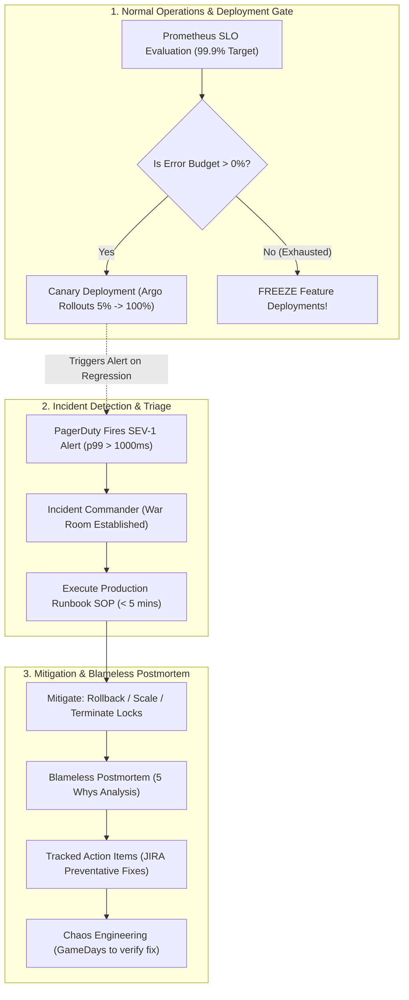

# Module 27: Production Engineering & Incident Management

Master enterprise-grade Site Reliability Engineering (SRE), continuous deployment, and disaster recovery: SLI/SLO/SLA mathematical modeling and Error Budget policies, zero-downtime deployment strategies (Blue-Green, Argo Canary releases, Feature Flags), Disaster Recovery calculus (RTO vs RPO, Pilot Light, Warm Standby, Multi-Region Active-Active), Incident Command Systems (ICS) and Blameless Postmortems with the 5 Whys, and mission-critical Production Runbooks paired with Chaos Engineering GameDays.

---

## 🗺️ Master SRE Incident & Production Operations Loop

---

## 📚 Curriculum Lessons

| # | Lesson | Core Focus & Mechanics |
|:---:|---|---|
| **01** | [`01-reliability-targets-sli-slo-sla-and-error-budgets.md`](./01-reliability-targets-sli-slo-sla-and-error-budgets.md) | SLIs (Good/Total ratio), SLOs (99.9%), SLAs with penalties, Error Budget calculations, and deployment freeze policies. |
| **02** | [`02-deployment-strategies-blue-green-canary-and-feature-flags.md`](./02-deployment-strategies-blue-green-canary-and-feature-flags.md) | Rolling updates, Blue-Green atomic router swaps, Argo Canary progressive metric analysis, and Feature Flag kill switches. |
| **03** | [`03-disaster-recovery-rto-rpo-and-multi-region-architectures.md`](./03-disaster-recovery-rto-rpo-and-multi-region-architectures.md) | RTO vs RPO calculus, the 4 DR tiers (Backup, Pilot Light, Warm Standby, Active-Active), and Route 53 DNS failovers. |
| **04** | [`04-incident-management-on-call-and-blameless-postmortems.md`](./04-incident-management-on-call-and-blameless-postmortems.md) | Incident Commander (IC) role, SEV-1 to SEV-4 classification, 5 Whys Root Cause Analysis, and postmortem templates. |
| **05** | [`05-production-runbooks-and-chaos-engineering.md`](./05-production-runbooks-and-chaos-engineering.md) | Top 4 on-call SOP runbooks (HikariCP starvation, Kafka lag, CPU spikes, disk full) and Chaos Engineering GameDays. |

---

## ⚡ Key Production Takeaways

1. **Error Budget Policy**: Treat Error Budgets as an objective contract: freeze feature releases when the budget hits 0%.
2. **Canary Over Big-Bang**: Use canary rollouts with automated Prometheus metric analysis to limit regression blast radius to $< 5\%$ of users.
3. **Decouple Deploy from Release**: Use feature flags to deploy dormant code continuously and activate features progressively.
4. **Blameless Culture Drives Reliability**: Investigate systemic vulnerabilities with the 5 Whys rather than blaming individuals.
5. **Codify Runbooks & Chaos**: Every PagerDuty alert must have an actionable runbook SOP, continuously validated via Chaos Engineering GameDays.
