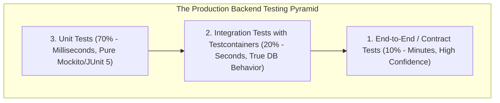
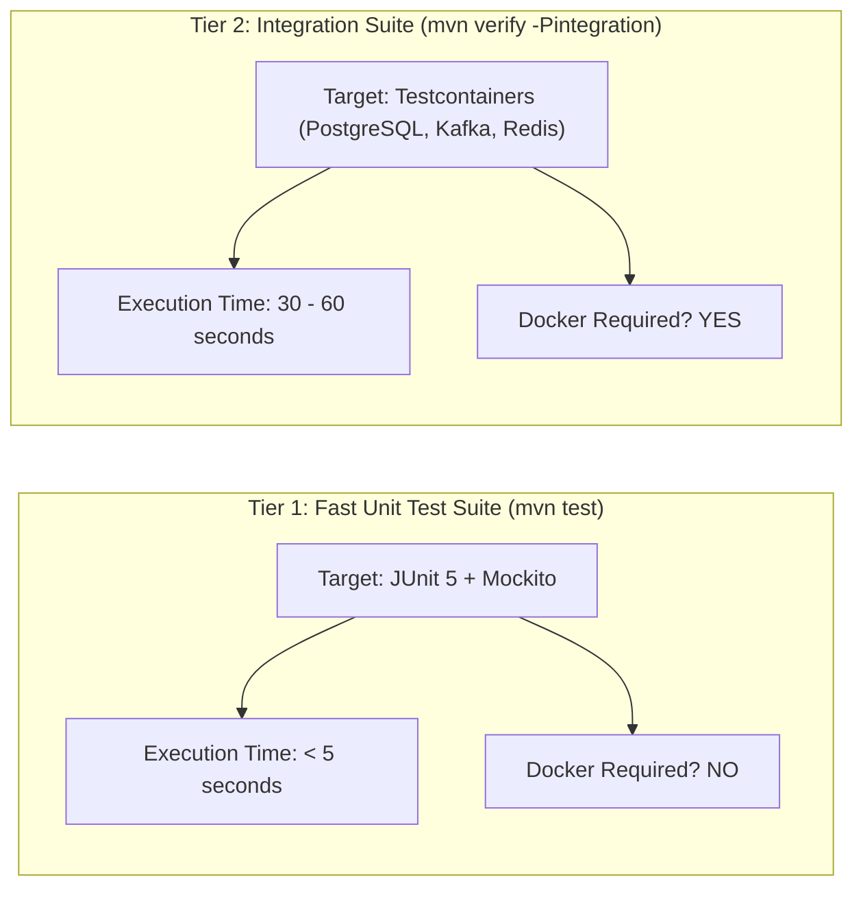

# The Backend Testing Pyramid and Two-Tier Testing Architecture

---

## 1. What Is It?
The **Backend Testing Pyramid** is a software engineering strategy that balances testing speed, operational execution cost, and behavioral confidence by structuring tests into 3 discrete layers:
1. **Unit Tests ($70\%$)**: Fast, isolated, in-memory tests verifying single classes or domain functions in microseconds ($< 1\text{ms}$).
2. **Integration Tests ($20\%$)**: Tests verifying interaction between the application and real external infrastructure (PostgreSQL, Redis, Kafka) using **Testcontainers**.
3. **End-to-End / Contract Tests ($10\%$)**: Verifying cross-service API contracts and full user journeys.

---

## 2. Why Does It Exist?

### The Inverted "Ice Cream Cone" Anti-Pattern
When engineering teams rely heavily on end-to-end (E2E) staging tests rather than unit and integration tests:
- **CI Build Explosion**: Test suites take $45\text{ minutes}$ to run, slowing developer deployment velocity to a crawl.
- **Flakiness & False Positives**: Unrelated network drops or third-party API downtime cause $30\%$ of staging builds to fail randomly, training engineers to ignore failing tests.



---

## 3. The Two-Tier Testing Architecture in Maven

$$\textbf{Production Invariant: } \text{Developers must be able to run } \texttt{mvn test} \text{ in 5 seconds without Docker, while CI verifies } \texttt{mvn verify -Pintegration}\text{!}$$



---

## 4. Why In-Memory H2 Database Is an Anti-Pattern for PostgreSQL Testing

Many legacy Spring Boot applications test against an embedded **H2 in-memory database** (`jdbc:h2:mem:testdb`):

### The 4 Fatal Flaws of H2 Testing:
1. **Dialect Drift**: H2 accepts SQL syntax that crashes on real PostgreSQL, and rejects valid PostgreSQL syntax.
2. **Missing Advanced Data Types**: H2 has broken or missing support for `JSONB`, `UUID`, arrays, and PostgreSQL `GIN` indexes.
3. **Concurrency & Locking Divergence**: H2 uses naive table-level locking; it **cannot reproduce PostgreSQL MVCC row-locking deadlocks or read phenomena**.
4. **False Sense of Security**: 100% of H2 tests can pass in CI, only for the application to throw SQL syntax errors immediately upon deployment to production PostgreSQL.

$$\textbf{Production Standard: } \text{NEVER use H2 for PostgreSQL testing. ALWAYS use Testcontainers with the exact same PostgreSQL Docker version!}$$

---

## 5. Implementation: Maven Two-Tier Profile Configuration (`pom.xml`)

```xml
<project>
    <!-- Build Plugins: Surefire for Unit Tests, Failsafe for Integration Tests -->
    <build>
        <plugins>
            <!-- Tier 1: Unit Tests (Runs on 'mvn test') -->
            <plugin>
                <groupId>org.apache.maven.plugins</groupId>
                <artifactId>maven-surefire-plugin</artifactId>
                <version>3.3.1</version>
                <configuration>
                    <includes>
                        <include>**/*Test.java</include>
                    </includes>
                    <excludes>
                        <exclude>**/*IT.java</exclude>
                    </excludes>
                </configuration>
            </plugin>
        </plugins>
    </build>

    <profiles>
        <!-- Tier 2: Integration Tests (Runs on 'mvn verify -Pintegration') -->
        <profile>
            <id>integration</id>
            <build>
                <plugins>
                    <plugin>
                        <groupId>org.apache.maven.plugins</groupId>
                        <artifactId>maven-failsafe-plugin</artifactId>
                        <version>3.3.1</version>
                        <executions>
                            <execution>
                                <goals>
                                    <goal>integration-test</goal>
                                    <goal>verify</goal>
                                </goals>
                            </execution>
                        </executions>
                        <configuration>
                            <includes>
                                <include>**/*IT.java</include>
                            </includes>
                        </configuration>
                    </plugin>
                </plugins>
            </build>
        </profile>
    </profiles>
</project>
```

---

## 6. Performance

| Testing Strategy | Suite Execution Time ($500\text{ Tests}$) | Production Parity Confidence | Required Local Tools |
|---|---|---|:---:|
| H2 In-Memory DB | $8\text{ seconds}$ | ❌ **Low (Dialect mismatch)** | Java only |
| **Two-Tier Architecture (Testcontainers)** | **$4\text{s (Tier 1)} + 35\text{s (Tier 2)}$** | ✅ **100% (Exact Postgres binary)** | **Java + Docker** |

---

## 7. Interview Questions

### Q1: Why is using Testcontainers for integration testing vastly superior to running an embedded in-memory database like H2?
<details>
<summary>Reveal Answer</summary>

**Answer**:
1. **$100\%$ Production Engine Parity**:
   - Testcontainers spins up a real, ephemeral Docker container running the **exact same version of PostgreSQL** (e.g. `postgres:16.4-alpine`) used in production AWS RDS.
   - All complex database features—including native JSONB operators (`->>`, `@>`), GIN indexes, window functions, trigger procedures, and transaction isolation semantics—behave identically in tests and production.
2. **Eliminating Dialect Divergence**:
   - H2 emulates PostgreSQL superficially, but frequently fails on valid PostgreSQL syntax or permits illegal queries that fail in production.
3. **Zero Host Pollution & Test Isolation**:
   - Each integration test run starts fresh, isolated containers with automatic teardown (via Testcontainers Ryuk), guaranteeing zero leftover test data or port collision issues on developer machines.
</details>

---

## 8. Quick Revision
- **Testing Pyramid**: 70% Unit, 20% Integration, 10% E2E.
- **Two-Tier Architecture**: Fast unit tests (`mvn test`) vs Containerized integration tests (`mvn verify -Pintegration`).
- **Never Use H2**: H2 misses JSONB, GIN indexes, and real MVCC locking; use Testcontainers instead.
- **Surefire vs Failsafe**: Surefire executes `*Test.java`; Failsafe executes `*IT.java`.
