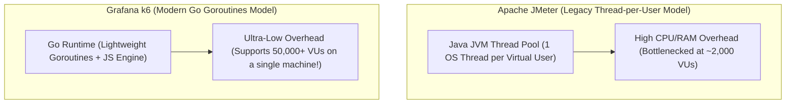

# Performance & Load Testing: Grafana k6, JMeter, and Stress Testing

---

## 1. What Is It?
**Performance & Load Testing** is the empirical engineering practice of subjecting a backend system to synthetic, controlled concurrent traffic loads to validate latency percentiles, throughput ceilings (QPS/TPS), resource saturation thresholds, and stability under peak stress.

The 4 core performance testing archetypes are:
1. **Load Testing**: Verifying system behavior under expected normal peak traffic ($1\times - 2\times$ load).
2. **Stress Testing**: Progressively increasing traffic until the system breaks to identify the **Bottleneck and Failure Mode**.
3. **Spike Testing**: Simulating sudden, instantaneous surges in traffic (e.g. Flash sales, ticket drops).
4. **Soak / Endurance Testing**: Running sustained moderate traffic for $12 - 48\text{ hours}$ to uncover slow **Memory Leaks and Connection Pool Starvation**.

---

## 2. Why Does It Exist?
- **Unverified Concurrency Ceilings**: A service passing $100\%$ of functional unit tests can completely collapse under 500 concurrent users due to database connection pool limits or lock contention.
- **Automated Performance Regression Gates in CI/CD**: Load tests running in CI automatically fail builds if a new code commit degrades $p99$ latency past defined Service Level Objectives (**SLOs**).

---

## 3. Tooling Comparison: Grafana k6 vs Apache JMeter



| Dimension | Apache JMeter | Grafana k6 |
|---|---|---|
| **Authoring Language** | XML / Heavy Desktop GUI | **Standard JavaScript (ES6) / TypeScript** |
| **Concurrency Model** | 1 OS Thread per Virtual User | **Go Goroutines (Ultra-Lightweight)** |
| **Max VUs per Machine** | $\approx 2,000\text{ Virtual Users}$ | **$> 50,000\text{ Virtual Users}$** |
| **CI/CD Integration** | Complex | **Native CLI / Docker (`k6 run test.js`)** |
| **Threshold Assertions** | Clunky XML assertions | **Built-in Declarative SLO Thresholds** |

---

## 4. Implementation: Production Load Test Script in Grafana k6

```javascript
// load-test-payment-api.js
import http from 'k6/http';
import { check, sleep } from 'k6';

// 1. Declarative Test Configuration & Ramp-Up Stages
export const options = {
  stages: [
    { duration: '1m', target: 50 },   // Ramp-up to 50 Virtual Users over 1 minute
    { duration: '3m', target: 200 },  // Ramp-up to 200 Virtual Users over 3 minutes
    { duration: '5m', target: 200 },  // Plateau at 200 VUs for 5 minutes (Steady State)
    { duration: '1m', target: 0 },    // Ramp-down to 0 VUs (Cool down)
  ],

  // 2. Strict SLO Performance Thresholds (Fails CI Build if Breached!)
  thresholds: {
    // 95% of requests must complete under 200ms; 99% under 500ms
    http_req_duration: ['p(95)<200', 'p(99)<500'],
    
    // HTTP error rate must remain strictly below 0.1% (99.9% Success Rate)
    http_req_failed: ['rate<0.001'],
  },
};

// 3. User Journey Execution Loop
export default function () {
  const payload = JSON.stringify({
    userId: Math.floor(Math.random() * 10000) + 1,
    amountCents: 2500,
    currency: 'USD',
  });

  const params = {
    headers: {
      'Content-Type': 'application/json',
      'Authorization': 'Bearer test-jwt-token',
    },
  };

  // Execute HTTP POST Request
  const res = http.post('http://localhost:8080/api/v1/payments', payload, params);

  // Assertions (Checks)
  check(res, {
    'status is 200 OK': (r) => r.status === 200,
    'has transaction ID': (r) => JSON.parse(r.body).transactionId !== undefined,
  });

  // User Think Time (Simulates realistic human pause between 0.5s - 1.5s)
  sleep(Math.random() * 1.0 + 0.5);
}
```

---

## 5. Running k6 in CI/CD & Analyzing Output

```bash
k6 run load-test-payment-api.js
```

### Typical Output:
```text
  ✓ status is 200 OK
  ✓ has transaction ID

  checks.........................: 100.00% ✓ 84210      ✗ 0
  http_req_duration..............: avg=42.1ms min=1.2ms med=28.4ms max=312.4ms p(95)=118.2ms p(99)=210.4ms
  ✓ { p(95)<200 }................: 118.2ms
  ✓ { p(99)<500 }................: 210.4ms
  http_req_failed................: 0.00%   ✓ 0          ✗ 84210
  ✓ { rate<0.001 }...............: 0.00%
  iterations.....................: 84210   280.7/s
```

---

## 6. Performance

| Testing Tool | CPU Consumption at 5,000 VUs | Test Script Maintainability |
|---|---|---|
| Apache JMeter | **$100\%$ CPU (Machine Overload)** | ❌ Difficult (XML format) |
| **Grafana k6** | **$\approx 15\%$ CPU** | ✅ **Code-first (Git versioned JS)** |

---

## 7. Interview Questions

### Q1: What is the purpose of a "Soak Test" (Endurance Test) and what specific classes of backend bugs does it uncover that standard 5-minute load tests miss?
<details>
<summary>Reveal Answer</summary>

**Answer**:
A **Soak Test (Endurance Test)** runs a system under continuous, moderate load ($60\% - 80\%$ of peak capacity) for an extended duration (typically $12 - 48\text{ hours}$).
- **Why short 5-minute tests miss critical bugs**:
  1. **Slow JVM Memory Leaks**: A memory leak that consumes $10\text{MB/hour}$ will pass a 5-minute load test with zero issues. During a 24-hour soak test, the leaked memory accumulates to 240MB, gradually exhausting the heap and triggering aggressive Full GC pauses or OOM kills.
  2. **Database Connection & Resource Pool Leaks**: Leaks where connections or Redis socket handles are not closed in rare error branches (`finally` block omissions) take hours of continuous execution to deplete the pool.
  3. **Disk & Log File Saturation**: Identifies runaway debug logging or un-rotated log buffers that consume root disk partitions over time.
</details>

---

## 8. Quick Revision
- **Load Testing**: Verifies normal peak capacity.
- **Stress Testing**: Ramps load until breaking point to find bottlenecks.
- **Soak Testing**: Runs for 12–48 hours to uncover slow memory leaks.
- **Grafana k6**: Modern Go-based load testing tool with JS scripting.
- **Thresholds**: Declarative SLO assertions (`p(95)<200`) fail CI builds on performance regressions.
