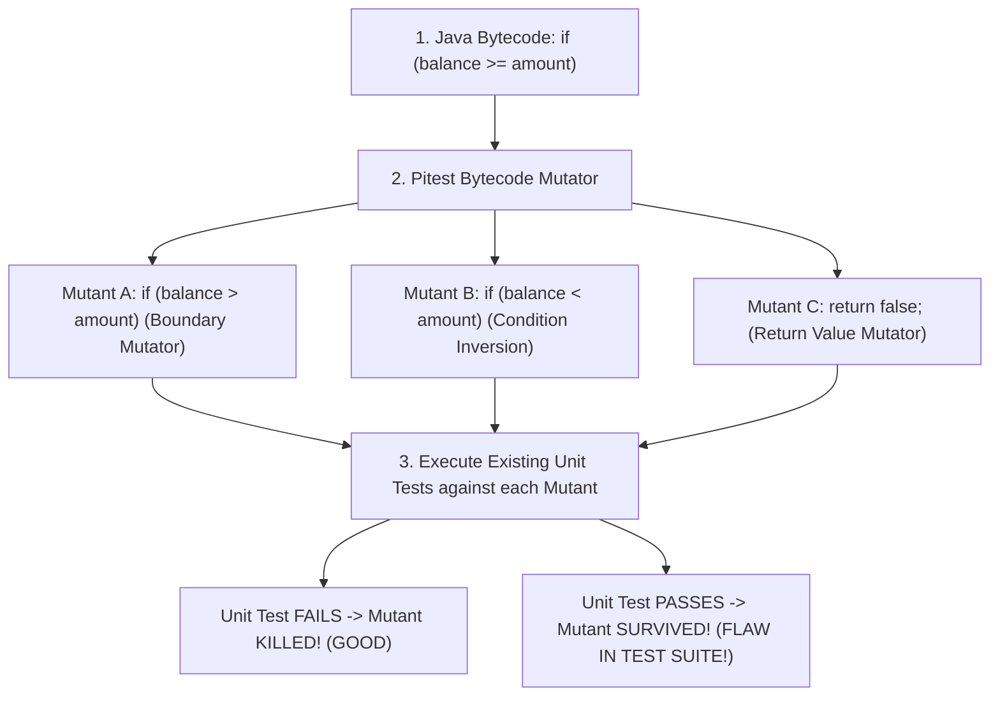

# Advanced Testing: Mutation Testing (Pitest) and Network Chaos (Toxiproxy)

---

## 1. What Is It?
In advanced backend quality engineering:
- **Mutation Testing (Pitest / PIT)**: A fault-injection testing technique that evaluates the **effectiveness and quality of your test suite** by introducing deliberate defects (Mutants) into compiled Java bytecode and verifying that existing unit tests fail (kill the mutant).
- **Network Chaos Testing (Toxiproxy)**: A TCP proxy framework that programmatically simulates real-world network anomalies (latency spikes, connection resets, bandwidth limits) during automated integration tests.

---

## 2. The Illusion of 100% Code Coverage

```java
// Production Code
public boolean isEligibleForDiscount(User user) {
    if (user.getAge() >= 65) {
        return true;
    }
    return false;
}

// Low-Quality Unit Test (Hits 100% Line Coverage!)
@Test
void testDiscount() {
    User senior = new User(70);
    boolean result = discountService.isEligibleForDiscount(senior);
    // DEVELOPER FORGOT TO WRITE ASSERTIONS! (assert result == true)
}
```
- **The Coverage Lie**: Standard tools (JaCoCo) report **$100\%$ Line Coverage**, but the test asserts **nothing**. If an engineer modifies `>= 65` to `<= 65`, the test suite still passes $100\%$!
- **Mutation Testing** catches this: It mutates the bytecode (changing `>=` to `<`), runs the test, sees the test still pass, and flags a **"Survived Mutant" (Test Suite Failure)**!

---

## 3. Mental Model: The Mutation Testing Lifecycle



---

## 4. How Does It Work?

### The Mutation Score Formula

$$\text{Mutation Score} = \left( \frac{\text{Killed Mutants}}{\text{Total Mutants Generated}} \right) \times 100\%$$

- A test suite with $90\%$ Line Coverage but only $40\%$ Mutation Score is **fragile and missing critical assertion boundaries**.

---

## 5. Implementation: Pitest Maven Plugin Configuration (`pom.xml`)

```xml
<plugin>
    <groupId>org.pitest</groupId>
    <artifactId>pitest-maven</artifactId>
    <version>1.16.1</version>
    <dependencies>
        <dependency>
            <groupId>org.pitest</groupId>
            <artifactId>pitest-junit5-plugin</artifactId>
            <version>1.2.1</version>
        </dependency>
    </dependencies>
    <configuration>
        <targetClasses>
            <param>com.backend.engineering.service.*</param>
            <param>com.backend.engineering.domain.*</param>
        </targetClasses>
        <targetTests>
            <param>com.backend.engineering.*Test</param>
        </targetTests>
        <mutators>
            <mutator>STRONGER</mutator> <!-- Conditionals, Math, Returns, Void calls -->
        </mutators>
        <mutationThreshold>85</mutationThreshold> <!-- Fails build if mutation score < 85% -->
    </configuration>
</plugin>
```

---

## 6. Implementation: Network Chaos Testing with Toxiproxy & Testcontainers

```java
package com.backend.engineering.testing.chaos;

import com.backend.engineering.service.PaymentService;
import eu.rekawek.toxiproxy.Proxy;
import eu.rekawek.toxiproxy.ToxiproxyClient;
import eu.rekawek.toxiproxy.model.ToxicDirection;
import org.junit.jupiter.api.DisplayName;
import org.junit.jupiter.api.Test;
import org.springframework.beans.factory.annotation.Autowired;
import org.springframework.boot.test.context.SpringBootTest;
import org.testcontainers.containers.Network;
import org.testcontainers.containers.PostgreSQLContainer;
import org.testcontainers.containers.ToxiproxyContainer;
import org.testcontainers.junit.jupiter.Container;
import org.testcontainers.junit.jupiter.Testcontainers;

import static org.assertj.core.api.Assertions.assertThatThrownBy;

@SpringBootTest
@Testcontainers
public class DatabaseChaosResilienceIT {

    private static final Network network = Network.newNetwork();

    // 1. PostgreSQL Container attached to isolated network
    @Container
    private static final PostgreSQLContainer<?> postgres = 
            new PostgreSQLContainer<>("postgres:16.4-alpine")
                    .withNetwork(network)
                    .withNetworkAliases("postgres-internal");

    // 2. Toxiproxy Container proxying traffic to PostgreSQL
    @Container
    private static final ToxiproxyContainer toxiproxy = 
            new ToxiproxyContainer("ghcr.io/shopify/toxiproxy:2.9.0")
                    .withNetwork(network);

    @Autowired
    private PaymentService paymentService;

    @Test
    @DisplayName("Should trip circuit breaker and throw timeout when DB latency exceeds 3000ms")
    void shouldHandleDatabaseLatencyChaos() throws Exception {
        ToxiproxyClient client = new ToxiproxyClient(toxiproxy.getHost(), toxiproxy.getControlPort());
        Proxy postgresProxy = client.createProxy("postgres", "0.0.0.0:8666", "postgres-internal:5432");

        // INJECT CHAOS: Add 3500ms latency to all database network packets!
        postgresProxy.toxics()
                .latency("high-db-latency", ToxicDirection.DOWNSTREAM, 3500);

        // Verify that application timeout / circuit breaker trips cleanly!
        assertThatThrownBy(() -> paymentService.findTransactionWithTimeout(101L))
                .isInstanceOf(DatabaseTimeoutException.class);

        // Remove Chaos
        postgresProxy.toxics().get("high-db-latency").remove();
    }
}
```

---

## 7. Performance & Quality Impact

| Quality Metric | Standard Line Coverage (JaCoCo) | Mutation Testing (Pitest) | Chaos Testing (Toxiproxy) |
|---|---|---|---|
| **Measures** | Which lines executed | **Whether tests actually catch bugs** | **Resilience to network splits/latency** |
| **False Confidence** | High | **Zero (Empirical verification)** | Zero |

---

## 8. Interview Questions

### Q1: What is a "Survived Mutant" in Mutation Testing, and how does it indicate a flaw in a test suite?
<details>
<summary>Reveal Answer</summary>

**Answer**:
In **Mutation Testing (Pitest)**:
1. The engine creates a modified version of your compiled bytecode (a **Mutant**) containing a synthetic bug (e.g. changing an `if (x > y)` condition to `if (x >= y)`, or deleting a method invocation).
2. It executes your existing unit test suite against this mutant.
3. If at least one unit test fails, the mutant is **Killed** (the test suite successfully caught the bug).
4. If **all unit tests still pass**, the mutant is said to have **Survived**.
- **Why this indicates a flaw**: A survived mutant proves that your test suite has a gap—either missing test cases for boundary values, weak assertions, or zero assertions on that execution path—proving that code coverage alone is insufficient to guarantee correctness.
</details>

---

## 9. Quick Revision
- **Line Coverage Fallacy**: Tests can execute lines without asserting correctness.
- **Mutation Testing**: Injects bytecode mutations; tests must fail to "kill" mutants.
- **Pitest**: Industry standard mutation testing plugin for Java.
- **Toxiproxy**: Injects real network latency, packet loss, and connection resets.
- **Resilience Verification**: Use Toxiproxy in Testcontainers to verify timeout and circuit breaker behavior under simulated network chaos.
