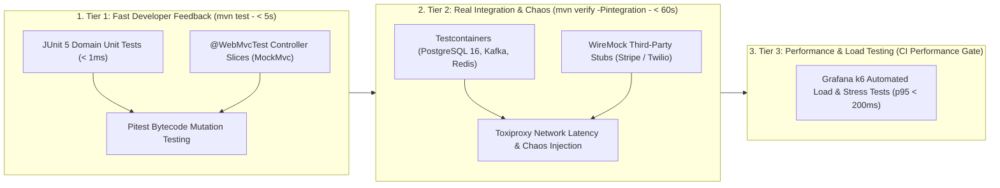

# Module 28: Testing Backend Systems

Master enterprise backend verification and quality engineering: The Two-Tier Testing Architecture (Fast `mvn test` unit suite vs Containerized `mvn verify -Pintegration` suite), why H2 in-memory databases are an anti-pattern for PostgreSQL, web slice testing with `@WebMvcTest` and `MockMvc` vs live `WebTestClient`, real Docker integration testing with Testcontainers and WireMock, modern load testing using Grafana k6 with declarative SLO thresholds, and advanced verification using Bytecode Mutation Testing (Pitest) and Network Chaos Testing (Toxiproxy).

---

## 🗺️ Master Two-Tier Verification & Quality Pipeline

---

## 📚 Curriculum Lessons

| # | Lesson | Core Focus & Mechanics |
|:---:|---|---|
| **01** | [`01-testing-pyramid-and-two-tier-testing-architecture.md`](./01-testing-pyramid-and-two-tier-testing-architecture.md) | The Testing Pyramid (70/20/10), Two-Tier Maven profiles, and the 4 fatal flaws of testing PostgreSQL with H2. |
| **02** | [`02-unit-and-web-slice-testing-mockmvc-vs-webtestclient.md`](./02-unit-and-web-slice-testing-mockmvc-vs-webtestclient.md) | Sub-400ms `@WebMvcTest` slices, `MockMvc` in-memory dispatching, live `WebTestClient`, and RFC 7807 `ProblemDetail`. |
| **03** | [`03-integration-testing-with-testcontainers-and-wiremock.md`](./03-integration-testing-with-testcontainers-and-wiremock.md) | Testcontainers Singleton Docker pattern, `@DynamicPropertySource`, and WireMock deterministic third-party failure stubs. |
| **04** | [`04-performance-and-load-testing-k6-and-jmeter.md`](./04-performance-and-load-testing-k6-and-jmeter.md) | Load/Stress/Soak testing, Grafana k6 vs JMeter, and declarative CI performance threshold assertions (`p(95)<200`). |
| **05** | [`05-advanced-testing-mutation-testing-and-chaos.md`](./05-advanced-testing-mutation-testing-and-chaos.md) | Code coverage illusions, Pitest bytecode mutation testing, and Toxiproxy network latency chaos injection. |

---

## ⚡ Key Production Takeaways

1. **Two-Tier Testing Standard**: Keep unit tests Docker-free and under 5 seconds; run containerized integration tests in the verify phase.
2. **Never Use H2 for PostgreSQL**: Use Testcontainers to run real PostgreSQL Docker instances with exact dialect and JSONB parity.
3. **Use Web Slices for Fast HTTP Tests**: Use `@WebMvcTest` with `MockMvc` to test controller routing and validation in $< 400\text{ms}$.
4. **Automate Load Tests with k6**: Use Grafana k6 scripts with strict threshold assertions to catch latency regressions in CI.
5. **Kill Mutants with Pitest**: Line coverage is not enough; use Mutation Testing to verify that test suites actually detect bugs.
