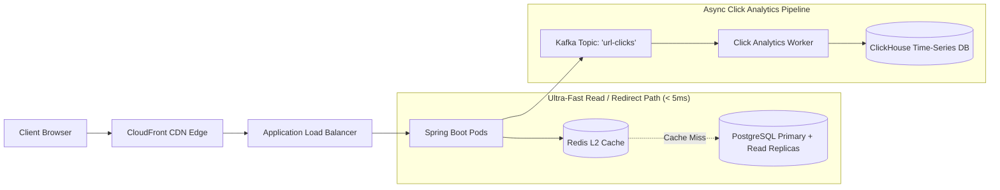

# Project 01: High-Throughput URL Shortener

Build an enterprise-grade, high-throughput URL shortening service (similar to Bitly/TinyURL) capable of handling 50,000+ redirect queries per second with sub-10ms $p99$ response times.

---

## 🗺️ System Architecture



---

## ⚡ Core Technical Components

### 1. 64-Bit Twitter Snowflake ID Generator
Generates collision-free, chronologically sortable 64-bit unique IDs across distributed pods:

```java
package com.backend.engineering.projects.urlshortener;

import org.springframework.stereotype.Component;

@Component
public class SnowflakeIdGenerator {
    private static final long EPOCH = 1704067200000L; // 2024-01-01T00:00:00Z
    private static final long WORKER_ID_BITS = 10L;
    private static final long SEQUENCE_BITS = 12L;

    private static final long MAX_WORKER_ID = ~(-1L << WORKER_ID_BITS);
    private static final long SEQUENCE_MASK = ~(-1L << SEQUENCE_BITS);

    private final long workerId = 1L; // Injected from Pod env: POD_INDEX
    private long sequence = 0L;
    private long lastTimestamp = -1L;

    public synchronized long nextId() {
        long currentTimestamp = System.currentTimeMillis();

        if (currentTimestamp < lastTimestamp) {
            throw new IllegalStateException("Clock moved backwards! Refusing to generate ID.");
        }

        if (currentTimestamp == lastTimestamp) {
            sequence = (sequence + 1) & SEQUENCE_MASK;
            if (sequence == 0) {
                // Sequence exhausted in current millisecond; wait for next ms
                while (currentTimestamp <= lastTimestamp) {
                    currentTimestamp = System.currentTimeMillis();
                }
            }
        } else {
            sequence = 0L;
        }

        lastTimestamp = currentTimestamp;

        return ((currentTimestamp - EPOCH) << (WORKER_ID_BITS + SEQUENCE_BITS))
                | (workerId << SEQUENCE_BITS)
                | sequence;
    }
}
```

---

### 2. Base62 Encoding Engine
Converts a 64-bit numeric ID into a compact 7-character URL-safe string:

```java
package com.backend.engineering.projects.urlshortener;

public final class Base62Encoder {
    private static final String BASE62_ALPHABET = 
            "0123456789ABCDEFGHIJKLMNOPQRSTUVWXYZabcdefghijklmnopqrstuvwxyz";
    private static final int BASE = BASE62_ALPHABET.length();

    private Base62Encoder() {}

    public static String encode(long value) {
        if (value == 0) return "0";
        StringBuilder sb = new StringBuilder();
        while (value > 0) {
            int remainder = (int) (value % BASE);
            sb.append(BASE62_ALPHABET.charAt(remainder));
            value /= BASE;
        }
        return sb.reverse().toString();
    }
}
```

---

### 3. Redirection Controller with Redis L2 Cache & Async Telemetry
```java
package com.backend.engineering.projects.urlshortener;

import org.springframework.data.redis.core.StringRedisTemplate;
import org.springframework.http.HttpHeaders;
import org.springframework.http.HttpStatus;
import org.springframework.http.ResponseEntity;
import org.springframework.kafka.core.KafkaTemplate;
import org.springframework.web.bind.annotation.*;

import java.net.URI;
import java.time.Duration;

@RestController
@RequestMapping
public class UrlRedirectController {

    private final StringRedisTemplate redisTemplate;
    private final UrlMappingRepository urlRepository;
    private final KafkaTemplate<String, Object> kafkaTemplate;

    public UrlRedirectController(StringRedisTemplate redisTemplate,
                                 UrlMappingRepository urlRepository,
                                 KafkaTemplate<String, Object> kafkaTemplate) {
        this.redisTemplate = redisTemplate;
        this.urlRepository = urlRepository;
        this.kafkaTemplate = kafkaTemplate;
    }

    @GetMapping("/{shortCode}")
    public ResponseEntity<Void> redirectUrl(@PathVariable String shortCode,
                                           @RequestHeader(HttpHeaders.USER_AGENT) String userAgent,
                                           @RequestHeader(value = "X-Forwarded-For", defaultValue = "127.0.0.1") String clientIp) {
        String cacheKey = "url:" + shortCode;

        // 1. Check Redis L2 Cache (< 1ms)
        String originalUrl = redisTemplate.opsForValue().get(cacheKey);

        if (originalUrl == null) {
            // 2. Cache Miss -> Query PostgreSQL Read Replica
            originalUrl = urlRepository.findByShortCode(shortCode)
                    .map(UrlMapping::getOriginalUrl)
                    .orElseThrow(() -> new ResourceNotFoundException("Short URL not found"));

            // 3. Populate Redis Cache with 7-Day TTL
            redisTemplate.opsForValue().set(cacheKey, originalUrl, Duration.ofDays(7));
        }

        // 4. Asynchronously Publish Click Telemetry to Kafka (Zero latency overhead on HTTP response!)
        kafkaTemplate.send("url-clicks", new ClickEvent(shortCode, clientIp, userAgent, System.currentTimeMillis()));

        // 5. HTTP 302 Temporary Redirect (Allows telemetry tracking on every click)
        return ResponseEntity.status(HttpStatus.FOUND)
                .location(URI.create(originalUrl))
                .build();
    }
}
```

---

## 4. Key Performance Invariants
1. **$p99 < 5\text{ms}$**: $99\%$ of redirects hit Redis RAM; zero disk reads on the critical path.
2. **Asynchronous Telemetry**: Kafka buffers click tracking events to protect ClickHouse from traffic spikes.
