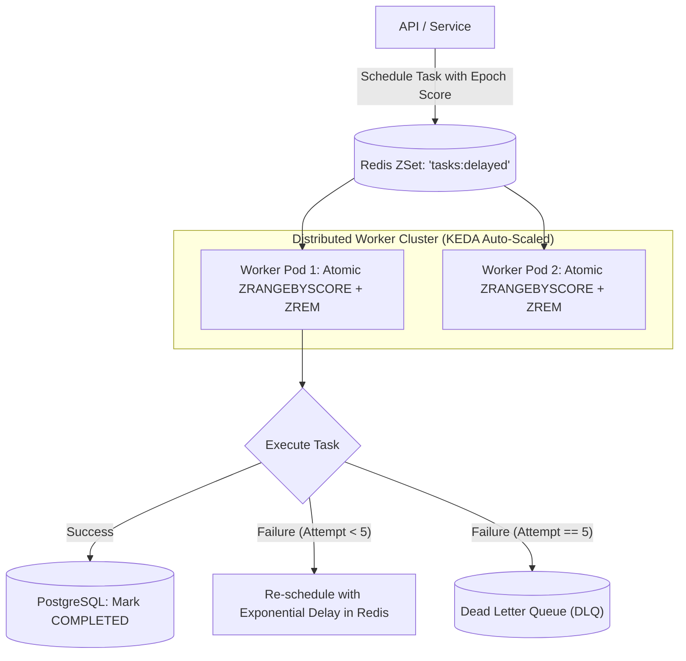

# Project 03: Distributed Job Scheduler and Delayed Queue Worker

Build a fault-tolerant distributed job scheduler supporting recurring cron schedules, delayed task queues (via Redis Sorted Sets), optimistic task claiming, exponential backoff retries, and Dead Letter Queues (DLQ).

---

## 🗺️ System Architecture



---

## ⚡ Implementation: Delayed Task Poller & Claimer

```java
package com.backend.engineering.projects.jobscheduler;

import org.springframework.data.redis.core.StringRedisTemplate;
import org.springframework.data.redis.core.ZSetOperations;
import org.springframework.scheduling.annotation.Scheduled;
import org.springframework.stereotype.Service;

import java.time.Duration;
import java.util.Set;
import java.util.concurrent.ExecutorService;
import java.util.concurrent.Executors;

@Service
public class DelayedJobSchedulerWorker {

    private static final String DELAYED_QUEUE_KEY = "tasks:delayed";
    private final StringRedisTemplate redisTemplate;
    private final JobExecutionService jobExecutionService;
    private final ExecutorService workerPool = Executors.newVirtualThreadPerTaskExecutor();

    public DelayedJobSchedulerWorker(StringRedisTemplate redisTemplate, JobExecutionService jobExecutionService) {
        this.redisTemplate = redisTemplate;
        this.jobExecutionService = jobExecutionService;
    }

    // Schedule a task for future execution
    public void scheduleDelayedJob(String taskId, Duration delay) {
        long executionTimestamp = System.currentTimeMillis() + delay.toMillis();
        redisTemplate.opsForZSet().add(DELAYED_QUEUE_KEY, taskId, executionTimestamp);
    }

    // Poll ready tasks every 500ms
    @Scheduled(fixedDelay = 500)
    public void pollAndExecuteReadyTasks() {
        long now = System.currentTimeMillis();

        // 1. Fetch task IDs whose score (scheduled time) <= current epoch
        Set<ZSetOperations.TypedTuple<String>> readyTasks = 
                redisTemplate.opsForZSet().rangeByScoreWithScores(DELAYED_QUEUE_KEY, 0, now, 0, 50);

        if (readyTasks == null || readyTasks.isEmpty()) {
            return;
        }

        for (ZSetOperations.TypedTuple<String> task : readyTasks) {
            String taskId = task.getValue();
            if (taskId == null) continue;

            // 2. ATOMIC CLAIM: Remove from ZSet to ensure only ONE worker executes it!
            Long removed = redisTemplate.opsForZSet().remove(DELAYED_QUEUE_KEY, taskId);
            if (removed != null && removed > 0) {
                // Dispatched to lightweight Java 21 Virtual Thread!
                workerPool.submit(() -> jobExecutionService.executeJobWithRetry(taskId));
            }
        }
    }
}
```
