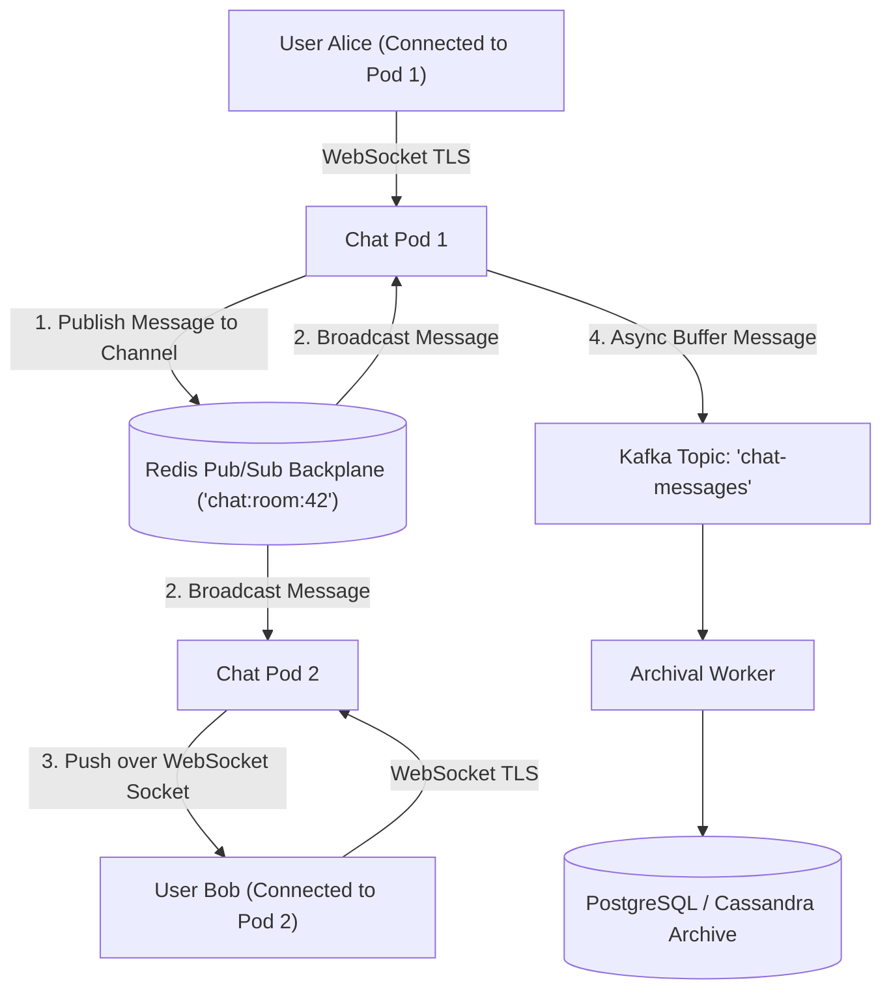

# Project 04: Real-Time Distributed Chat Platform

Build a horizontally scalable real-time chat platform supporting 1-on-1 direct messages, group chat channels, ephemeral user presence heartbeats, and Redis Pub/Sub inter-node broadcasting.

---

## 🗺️ System Architecture



---

## ⚡ Implementation: Spring Boot STOMP WebSocket & Redis Backplane

```java
package com.backend.engineering.projects.chat;

import org.springframework.context.annotation.Configuration;
import org.springframework.data.redis.connection.RedisConnectionFactory;
import org.springframework.data.redis.core.StringRedisTemplate;
import org.springframework.data.redis.listener.PatternTopic;
import org.springframework.data.redis.listener.RedisMessageListenerContainer;
import org.springframework.data.redis.listener.adapter.MessageListenerAdapter;
import org.springframework.messaging.simp.SimpMessagingTemplate;
import org.springframework.stereotype.Service;

@Service
public class ChatBroadcastingService {

    private final StringRedisTemplate redisTemplate;
    private final SimpMessagingTemplate simpMessagingTemplate;

    public ChatBroadcastingService(StringRedisTemplate redisTemplate, SimpMessagingTemplate simpMessagingTemplate) {
        this.redisTemplate = redisTemplate;
        this.simpMessagingTemplate = simpMessagingTemplate;
    }

    // Publish message from local client to global Redis cluster
    public void publishMessageToRoom(String roomId, String messageJson) {
        redisTemplate.convertAndSend("chat:room:" + roomId, messageJson);
    }

    // Called when Redis Pub/Sub receives a broadcasted message from ANY pod
    public void onRedisMessageReceived(String messageJson, String topicChannel) {
        String roomId = topicChannel.replace("chat:room:", "");
        // Broadcast over local WebSocket connections connected to THIS pod
        simpMessagingTemplate.convertAndSend("/topic/rooms/" + roomId, messageJson);
    }
}
```
