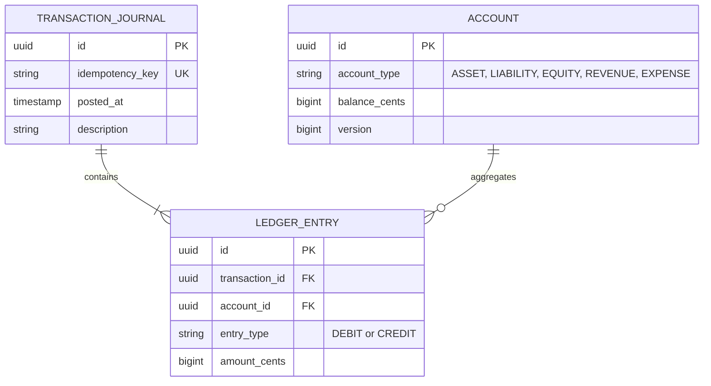

# Project 05: Double-Entry Financial Ledger System

Build a mission-critical, double-entry bookkeeping financial ledger system enforcing zero-balance invariants ($\sum \text{Debits} = \sum \text{Credits}$), immutable transaction journals, idempotency keys, and optimistic concurrency control.

---

## 🗺️ Accounting Invariants & Data Model

$$\sum \text{Debits} - \sum \text{Credits} = 0 \quad (\text{Mandatory Invariant across every transaction journal entry!})$$



---

## ⚡ Implementation: Double-Entry Transaction Service

```java
package com.backend.engineering.projects.ledger;

import org.springframework.stereotype.Service;
import org.springframework.transaction.annotation.Isolation;
import org.springframework.transaction.annotation.Transactional;

import java.util.List;
import java.util.UUID;

@Service
public class FinancialLedgerService {

    private final AccountRepository accountRepository;
    private final JournalRepository journalRepository;

    public FinancialLedgerService(AccountRepository accountRepository, JournalRepository journalRepository) {
        this.accountRepository = accountRepository;
        this.journalRepository = journalRepository;
    }

    @Transactional(isolation = Isolation.READ_COMMITTED)
    public TransactionJournal recordTransaction(String idempotencyKey, String description, List<EntryRequest> entries) {
        // 1. Idempotency Check
        var existingJournal = journalRepository.findByIdempotencyKey(idempotencyKey);
        if (existingJournal.isPresent()) {
            return existingJournal.get(); // Return already processed journal
        }

        // 2. Validate Zero-Balance Invariant (Total Debits == Total Credits)
        long totalDebits = entries.stream().filter(e -> e.type() == EntryType.DEBIT).mapToLong(EntryRequest::amountCents).sum();
        long totalCredits = entries.stream().filter(e -> e.type() == EntryType.CREDIT).mapToLong(EntryRequest::amountCents).sum();

        if (totalDebits != totalCredits) {
            throw new UnbalancedTransactionException("Total Debits (" + totalDebits + ") != Total Credits (" + totalCredits + ")");
        }

        // 3. Create Immutable Journal Record
        TransactionJournal journal = new TransactionJournal(UUID.randomUUID(), idempotencyKey, description);

        // 4. Update Account Balances with Optimistic Locking
        for (EntryRequest entry : entries) {
            Account account = accountRepository.findById(entry.accountId())
                    .orElseThrow(() -> new AccountNotFoundException("Account not found: " + entry.accountId()));

            if (entry.type() == EntryType.DEBIT) {
                account.debit(entry.amountCents());
            } else {
                account.credit(entry.amountCents());
            }

            accountRepository.save(account); // Evaluates version CAS on commit!
            journal.addEntry(new LedgerEntry(account.getId(), entry.type(), entry.amountCents()));
        }

        return journalRepository.save(journal);
    }
}
```
