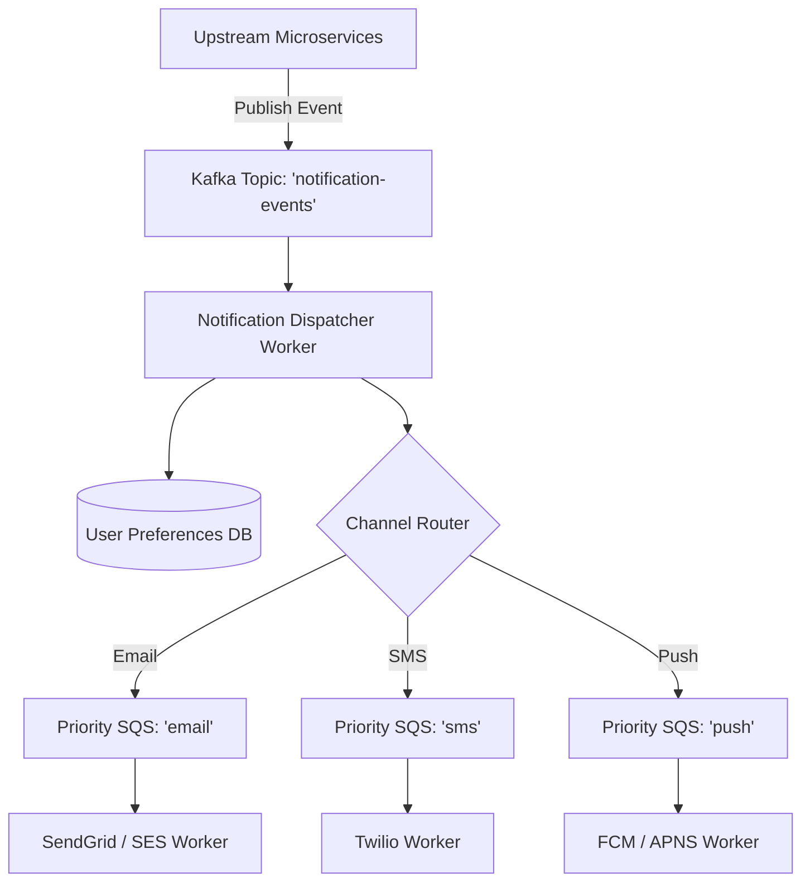

# Project 06: Event-Driven Multi-Channel Notification Engine

Build an asynchronous, high-throughput notification engine capable of delivering emails, SMS, mobile push (FCM/APNS), and webhooks with user preference filtering, multi-bucket priority queueing, and retry with exponential backoff.

---

## 🗺️ System Architecture



---

## ⚡ Implementation: Strategy Pattern Channel Dispatcher

```java
package com.backend.engineering.projects.notification;

import org.springframework.stereotype.Service;

import java.util.List;
import java.util.Map;
import java.util.function.Function;
import java.util.stream.Collectors;

@Service
public class NotificationChannelRouter {

    private final Map<NotificationChannel, ChannelDeliveryProvider> providers;
    private final UserPreferenceRepository userPreferenceRepository;

    public NotificationChannelRouter(List<ChannelDeliveryProvider> providerList, 
                                     UserPreferenceRepository userPreferenceRepository) {
        this.providers = providerList.stream()
                .collect(Collectors.toMap(ChannelDeliveryProvider::getChannelType, Function.identity()));
        this.userPreferenceRepository = userPreferenceRepository;
    }

    public void routeAndDeliver(NotificationPayload payload) {
        UserPreferences prefs = userPreferenceRepository.findByUserId(payload.userId());

        for (NotificationChannel channel : payload.requestedChannels()) {
            // Check if user has opted out of this channel
            if (!prefs.isChannelEnabled(channel, payload.category())) {
                continue; // Respect user opt-out preferences
            }

            ChannelDeliveryProvider provider = providers.get(channel);
            if (provider != null) {
                provider.deliverNotification(payload);
            }
        }
    }
}
```
