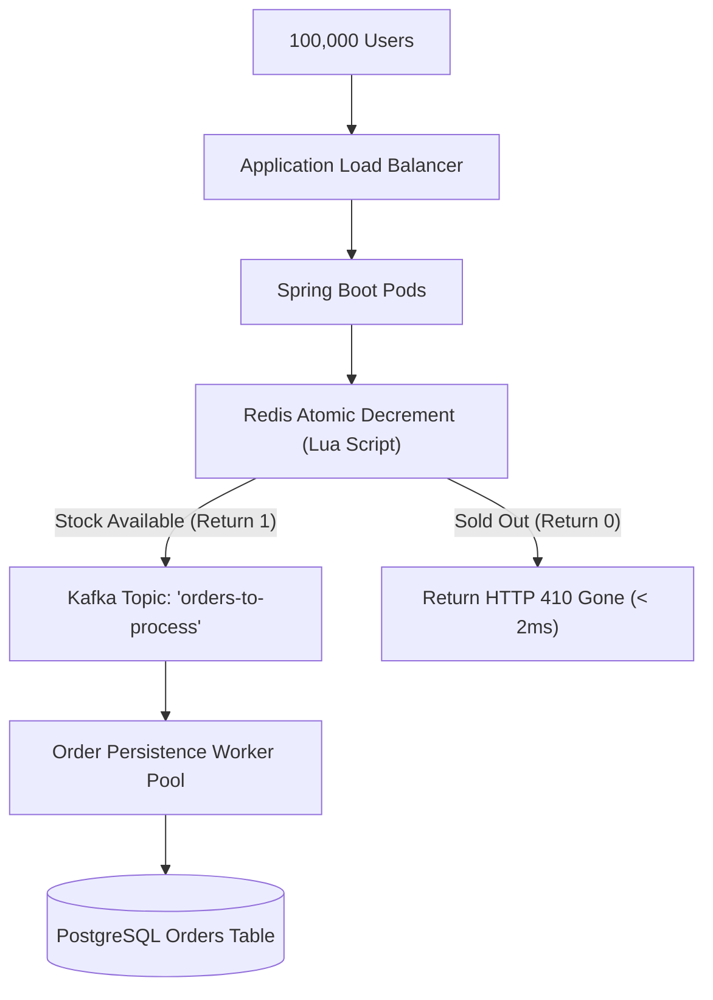

# Project 07: High-Concurrency E-Commerce Flash Sale System

Build a high-concurrency inventory reservation engine capable of handling 100,000 concurrent checkout attempts for a limited stock of 1,000 units without overselling, using atomic Redis Lua scripts and Kafka asynchronous write buffering.

---

## 🗺️ System Architecture



---

## ⚡ Implementation: Atomic Inventory Reservation in Redis Lua

```lua
-- reserve_inventory.lua
local stockKey = KEYS[1]
local userPurchasedKey = KEYS[2]
local userId = ARGV[1]
local quantity = tonumber(ARGV[2])

-- 1. Check if user already purchased (Prevent duplicate orders per user)
if redis.call('SISMEMBER', userPurchasedKey, userId) == 1 then
    return -1 -- ALREADY PURCHASED!
end

-- 2. Check current available stock
local currentStock = tonumber(redis.call('GET', stockKey) or "0")

if currentStock >= quantity then
    -- 3. Atomically decrement stock
    redis.call('DECRBY', stockKey, quantity)
    redis.call('SADD', userPurchasedKey, userId)
    return 1 -- RESERVATION SUCCESSFUL
else
    return 0 -- SOLD OUT
end
```

---

## ⚡ Implementation: Flash Sale Controller

```java
package com.backend.engineering.projects.flashsale;

import org.springframework.core.io.ClassPathResource;
import org.springframework.data.redis.core.StringRedisTemplate;
import org.springframework.data.redis.core.script.DefaultRedisScript;
import org.springframework.http.HttpStatus;
import org.springframework.http.ResponseEntity;
import org.springframework.kafka.core.KafkaTemplate;
import org.springframework.web.bind.annotation.*;

import java.util.List;

@RestController
@RequestMapping("/api/v1/flash-sale")
public class FlashSaleCheckoutController {

    private final StringRedisTemplate redisTemplate;
    private final KafkaTemplate<String, Object> kafkaTemplate;
    private final DefaultRedisScript<Long> reservationScript;

    public FlashSaleCheckoutController(StringRedisTemplate redisTemplate, KafkaTemplate<String, Object> kafkaTemplate) {
        this.redisTemplate = redisTemplate;
        this.kafkaTemplate = kafkaTemplate;
        this.reservationScript = new DefaultRedisScript<>();
        this.reservationScript.setLocation(new ClassPathResource("scripts/reserve_inventory.lua"));
        this.reservationScript.setResultType(Long.class);
    }

    @PostMapping("/purchase")
    public ResponseEntity<ApiResponse> purchaseItem(@RequestBody PurchaseRequest request) {
        String stockKey = "flash:stock:" + request.itemId();
        String userKey = "flash:users:" + request.itemId();

        List<String> keys = List.of(stockKey, userKey);
        Long result = redisTemplate.execute(reservationScript, keys, String.valueOf(request.userId()), String.valueOf(request.quantity()));

        if (result != null && result == 1L) {
            // Asynchronously buffer order creation into Kafka
            kafkaTemplate.send("orders-to-process", new OrderPlacementEvent(request.userId(), request.itemId(), request.quantity()));
            return ResponseEntity.accepted().body(new ApiResponse("ORDER_RESERVED", "Inventory reserved. Processing payment..."));
        } else if (result != null && result == -1L) {
            return ResponseEntity.status(HttpStatus.CONFLICT).body(new ApiResponse("ALREADY_PURCHASED", "Limit 1 per customer."));
        } else {
            return ResponseEntity.status(HttpStatus.GONE).body(new ApiResponse("SOLD_OUT", "Item is completely sold out."));
        }
    }
}
```
