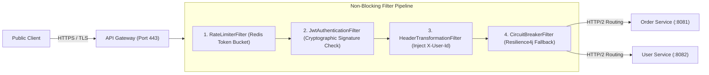

# Project 08: High-Performance API Gateway

Build a high-performance API Gateway supporting dynamic routing, JWT token validation, rate limiting, header transformation, and Resilience4j circuit breakers using Spring Cloud Gateway and Netty non-blocking event loops.

---

## 🗺️ System Architecture



---

## ⚡ Implementation: Spring Cloud Gateway Route Configuration

```yaml
spring:
  cloud:
    gateway:
      routes:
        # Route 1: Orders Microservice
        - id: order-service-route
          uri: lb://order-service
          predicates:
            - Path=/api/v1/orders/**
          filters:
            - name: RequestRateLimiter
              args:
                redis-rate-limiter.replenishRate: 100
                redis-rate-limiter.burstCapacity: 200
            - name: CircuitBreaker
              args:
                name: orderCircuitBreaker
                fallbackUri: forward:/fallback/orders
            - AddRequestHeader=X-Gateway-Processed, true

        # Route 2: Users Microservice
        - id: user-service-route
          uri: lb://user-service
          predicates:
            - Path=/api/v1/users/**
```
