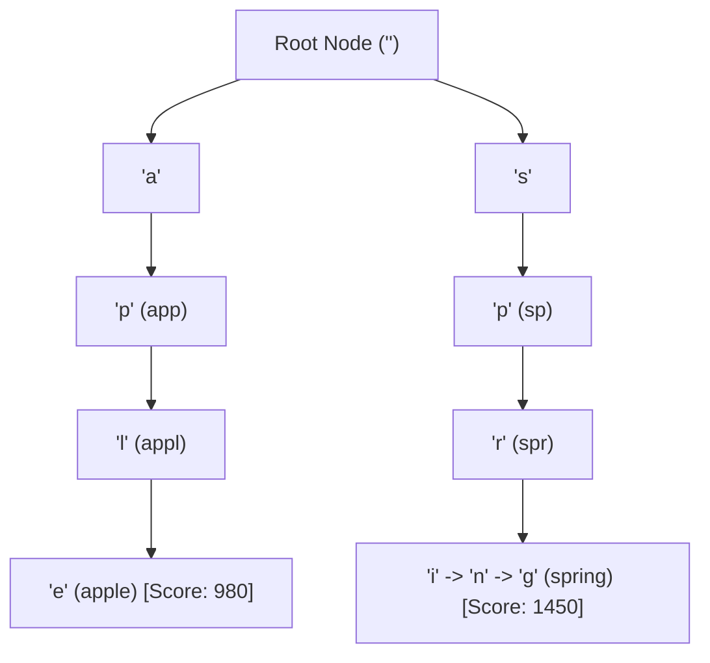

# Project 10: Search & Autocomplete Service (Inverted Index & Trie)

Build a high-speed search and prefix autocomplete engine combining an in-memory Trie data structure for sub-2ms prefix suggestions with Lucene Inverted Index text analysis and BM25 relevance scoring.

---

## 🗺️ In-Memory Trie Autocomplete Architecture



---

## ⚡ Implementation: In-Memory Prefix Trie with Top-K Suggestions

```java
package com.backend.engineering.projects.search;

import java.util.*;

public class AutocompleteTrieService {

    private static class TrieNode {
        Map<Character, TrieNode> children = new HashMap<>();
        PriorityQueue<Suggestion> topSuggestions = new PriorityQueue<>(
                Comparator.comparingLong(Suggestion::score) // Min-Heap for Top 10
        );
        boolean isEndOfWord = false;
    }

    public record Suggestion(String term, long score) {}

    private final TrieNode root = new TrieNode();
    private static final int MAX_SUGGESTIONS = 10;

    public synchronized void insertTerm(String term, long score) {
        TrieNode current = root;
        Suggestion suggestion = new Suggestion(term, score);

        for (char ch : term.toLowerCase().toCharArray()) {
            current = current.children.computeIfAbsent(ch, c -> new TrieNode());
            updateTopSuggestions(current.topSuggestions, suggestion);
        }
        current.isEndOfWord = true;
    }

    public List<Suggestion> getAutocompleteSuggestions(String prefix) {
        TrieNode current = root;
        for (char ch : prefix.toLowerCase().toCharArray()) {
            current = current.children.get(ch);
            if (current == null) return Collections.emptyList();
        }

        List<Suggestion> results = new ArrayList<>(current.topSuggestions);
        results.sort((a, b) -> Long.compare(b.score(), a.score())); // Sort descending
        return results;
    }

    private void updateTopSuggestions(PriorityQueue<Suggestion> heap, Suggestion newSuggestion) {
        heap.removeIf(s -> s.term().equals(newSuggestion.term())); // Update existing
        heap.offer(newSuggestion);
        if (heap.size() > MAX_SUGGESTIONS) {
            heap.poll(); // Evict lowest score
        }
    }
}
```
