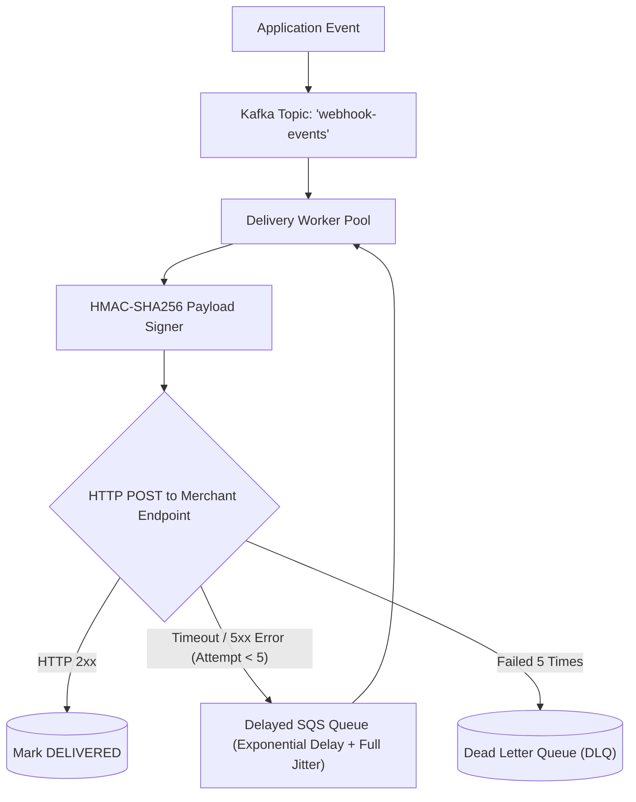

# Project 11: Enterprise Webhook Delivery Engine

Build a reliable outbound webhook delivery platform supporting cryptographic HMAC-SHA256 request signing, exponential backoff with full jitter, per-destination concurrency bulkheads, and Dead Letter Queues (DLQ).

---

## 🗺️ System Architecture



---

## ⚡ Implementation: HMAC-SHA256 Webhook Signer & Delivery Worker

```java
package com.backend.engineering.projects.webhook;

import org.apache.commons.codec.digest.HmacUtils;
import org.springframework.stereotype.Service;

import java.net.URI;
import java.net.http.HttpClient;
import java.net.http.HttpRequest;
import java.net.http.HttpResponse;
import java.time.Duration;

@Service
public class WebhookDeliveryService {

    private final HttpClient httpClient = HttpClient.newBuilder()
            .connectTimeout(Duration.ofSeconds(2))
            .build();

    public boolean deliverWebhook(String endpointUrl, String payloadJson, String merchantSecret) {
        long timestamp = System.currentTimeMillis() / 1000L;
        String signaturePayload = timestamp + "." + payloadJson;

        // 1. Generate HMAC-SHA256 Signature
        String hmacSignature = new HmacUtils("HmacSHA256", merchantSecret).hmacHex(signaturePayload);
        String headerValue = "t=" + timestamp + ",v1=" + hmacSignature;

        // 2. Build HTTP POST Request with 5-Second Timeout
        HttpRequest request = HttpRequest.newBuilder()
                .uri(URI.create(endpointUrl))
                .timeout(Duration.ofSeconds(5))
                .header("Content-Type", "application/json")
                .header("X-Signature-SHA256", headerValue)
                .POST(HttpRequest.BodyPublishers.ofString(payloadJson))
                .build();

        try {
            HttpResponse<String> response = httpClient.send(request, HttpResponse.BodyHandlers.ofString());
            return response.statusCode() >= 200 && response.statusCode() < 300;
        } catch (Exception ex) {
            return false; // Triggers exponential backoff retry!
        }
    }
}
```
