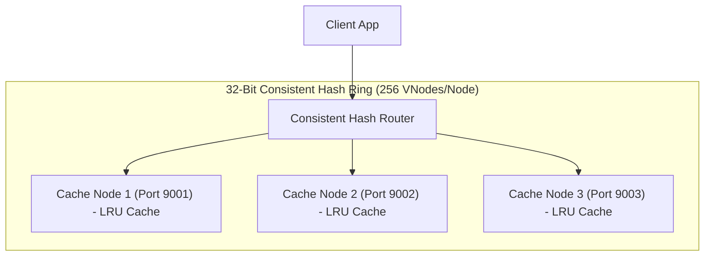

# Project 12: Distributed In-Memory Caching Engine

Build a custom distributed in-memory cache server featuring a 32-bit Consistent Hash Ring with Virtual Nodes, LRU eviction, and singleflight cache stampede protection in Java 21.

---

## 🗺️ System Architecture



---

## ⚡ Implementation: In-Memory LRU Cache with O(1) Operations

```java
package com.backend.engineering.projects.cache;

import java.util.HashMap;
import java.util.Map;
import java.util.concurrent.locks.ReentrantLock;

public class LruMemoryCache<K, V> {

    private static class Node<K, V> {
        K key;
        V value;
        Node<K, V> prev, next;
        Node(K key, V value) { this.key = key; this.value = value; }
    }

    private final int capacity;
    private final Map<K, Node<K, V>> map = new HashMap<>();
    private final Node<K, V> head = new Node<>(null, null);
    private final Node<K, V> tail = new Node<>(null, null);
    private final ReentrantLock lock = new ReentrantLock();

    public LruMemoryCache(int capacity) {
        this.capacity = capacity;
        head.next = tail;
        tail.prev = head;
    }

    public V get(K key) {
        lock.lock();
        try {
            Node<K, V> node = map.get(key);
            if (node == null) return null;
            moveToHead(node);
            return node.value;
        } finally {
            lock.unlock();
        }
    }

    public void put(K key, V value) {
        lock.lock();
        try {
            Node<K, V> node = map.get(key);
            if (node != null) {
                node.value = value;
                moveToHead(node);
            } else {
                Node<K, V> newNode = new Node<>(key, value);
                map.put(key, newNode);
                addToHead(newNode);
                if (map.size() > capacity) {
                    Node<K, V> lru = removeTail();
                    map.remove(lru.key);
                }
            }
        } finally {
            lock.unlock();
        }
    }

    private void addToHead(Node<K, V> node) {
        node.next = head.next;
        node.prev = head;
        head.next.prev = node;
        head.next = node;
    }

    private void removeNode(Node<K, V> node) {
        node.prev.next = node.next;
        node.next.prev = node.prev;
    }

    private void moveToHead(Node<K, V> node) {
        removeNode(node);
        addToHead(node);
    }

    private Node<K, V> removeTail() {
        Node<K, V> res = tail.prev;
        removeNode(res);
        return res;
    }
}
```
