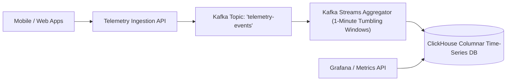

# Project 13: Real-Time Stream Analytics Pipeline

Build a real-time event analytics platform featuring high-throughput HTTP telemetry ingestion, Apache Kafka streaming, 1-minute tumbling window aggregations, and ClickHouse time-series storage.

---

## 🗺️ System Architecture



---

## ⚡ Implementation: 1-Minute Tumbling Window Stream Processor

```java
package com.backend.engineering.projects.analytics;

import org.apache.kafka.common.serialization.Serdes;
import org.apache.kafka.streams.StreamsBuilder;
import org.apache.kafka.streams.kstream.*;
import org.springframework.context.annotation.Bean;
import org.springframework.context.annotation.Configuration;

import java.time.Duration;

@Configuration
public class TelemetryStreamProcessingConfig {

    @Bean
    public KStream<String, Long> processTelemetryMetrics(StreamsBuilder builder) {
        KStream<String, String> rawEvents = builder.stream("telemetry-events", 
                Consumed.with(Serdes.String(), Serdes.String()));

        KTable<Windowed<String>, Long> aggregatedCounts = rawEvents
                .groupBy((key, value) -> extractEventName(value), Grouped.with(Serdes.String(), Serdes.String()))
                // 1-Minute Tumbling Time Window
                .windowedBy(TimeWindows.ofSizeWithNoGrace(Duration.ofMinutes(1)))
                .count(Materialized.as("aggregated-metrics-store"));

        KStream<String, Long> outputStream = aggregatedCounts.toStream()
                .map((key, value) -> new KeyValue<>(key.key() + "@" + key.window().start(), value));

        outputStream.to("aggregated-telemetry-output", Produced.with(Serdes.String(), Serdes.Long()));
        return outputStream;
    }

    private String extractEventName(String eventJson) {
        // Extracts "event_type" from JSON payload
        return "checkout_button_clicked";
    }
}
```
