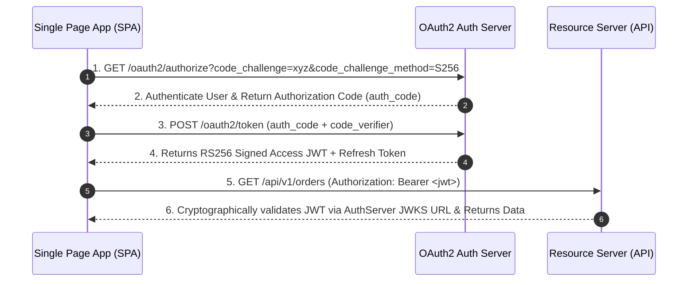

# Project 14: OAuth2 / OIDC Identity Server

Build a complete OAuth2 and OpenID Connect (OIDC) Identity & Access Management (IAM) server supporting Authorization Code Flow with PKCE, RS256 asymmetric JWT signing, refresh token rotation, and Role-Based Access Control (RBAC).

---

## 🗺️ OAuth2 PKCE Authorization Code Flow



---

## ⚡ Implementation: RS256 JWT Token Signer & Issuer

```java
package com.backend.engineering.projects.auth;

import com.nimbusds.jose.JWSAlgorithm;
import com.nimbusds.jose.JWSHeader;
import com.nimbusds.jose.crypto.RSASSASigner;
import com.nimbusds.jwt.JWTClaimsSet;
import com.nimbusds.jwt.SignedJWT;
import org.springframework.stereotype.Service;

import java.security.interfaces.RSAPrivateKey;
import java.time.Instant;
import java.time.temporal.ChronoUnit;
import java.util.Date;
import java.util.List;

@Service
public class JwtTokenIssuerService {

    private final RSAPrivateKey rsaPrivateKey;
    private final String issuer = "https://auth.company.internal";

    public JwtTokenIssuerService(RSAPrivateKey rsaPrivateKey) {
        this.rsaPrivateKey = rsaPrivateKey;
    }

    public String issueAccessToken(String userId, String email, List<String> roles) throws Exception {
        Instant now = Instant.now();

        JWTClaimsSet claims = new JWTClaimsSet.Builder()
                .issuer(issuer)
                .subject(userId)
                .claim("email", email)
                .claim("roles", roles)
                .issueTime(Date.from(now))
                .expirationTime(Date.from(now.plus(15, ChronoUnit.MINUTES))) // 15-minute expiry!
                .build();

        SignedJWT signedJWT = new SignedJWT(
                new JWSHeader.Builder(JWSAlgorithm.RS256).keyID("auth-key-2026").build(),
                claims
        );

        signedJWT.sign(new RSASSASigner(rsaPrivateKey));
        return signedJWT.serialize();
    }
}
```
