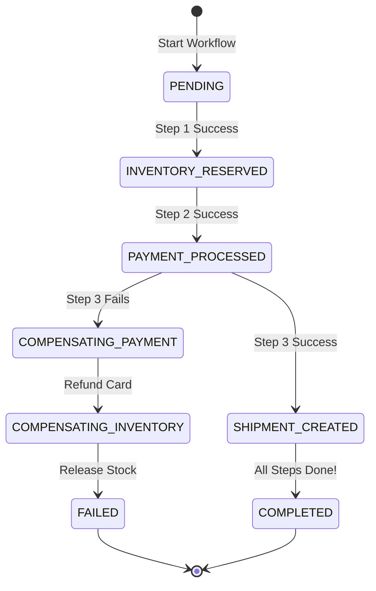

# Project 15: Distributed Workflow and Saga Orchestrator

Build an enterprise Saga orchestration engine supporting multi-step distributed business workflows, state machine persistence, automated compensating rollbacks, and idempotent retry semantics.

---

## 🗺️ Master Saga State Machine Lifecycle



---

## ⚡ Implementation: Saga State Machine Coordinator

```java
package com.backend.engineering.projects.saga;

import org.slf4j.Logger;
import org.slf4j.LoggerFactory;
import org.springframework.stereotype.Service;
import org.springframework.transaction.annotation.Transactional;

@Service
public class OrderSagaCoordinator {

    private static final Logger log = LoggerFactory.getLogger(OrderSagaCoordinator.class);

    private final SagaStateRepository stateRepository;
    private final InventoryClient inventoryClient;
    private final PaymentClient paymentClient;
    private final ShippingClient shippingClient;

    public OrderSagaCoordinator(SagaStateRepository stateRepository,
                                InventoryClient inventoryClient,
                                PaymentClient paymentClient,
                                ShippingClient shippingClient) {
        this.stateRepository = stateRepository;
        this.inventoryClient = inventoryClient;
        this.paymentClient = paymentClient;
        this.shippingClient = shippingClient;
    }

    public void executeOrderWorkflow(Long orderId, String sku, long amountCents, String address) {
        SagaInstance saga = stateRepository.create(orderId);

        // Step 1: Reserve Inventory
        boolean invOk = inventoryClient.reserveStock(orderId, sku);
        if (!invOk) {
            saga.transitionTo(SagaStatus.FAILED, "Inventory unavailable");
            stateRepository.save(saga);
            return;
        }
        saga.transitionTo(SagaStatus.INVENTORY_RESERVED, "Stock reserved");
        stateRepository.save(saga);

        // Step 2: Charge Payment
        boolean payOk = paymentClient.charge(orderId, amountCents);
        if (!payOk) {
            log.error("Payment failed for order {}. Compensating Step 1...", orderId);
            inventoryClient.releaseStock(orderId, sku); // COMPENSATION
            saga.transitionTo(SagaStatus.FAILED, "Payment declined");
            stateRepository.save(saga);
            return;
        }
        saga.transitionTo(SagaStatus.PAYMENT_PROCESSED, "Payment captured");
        stateRepository.save(saga);

        // Step 3: Dispatch Shipping
        boolean shipOk = shippingClient.createShipment(orderId, address);
        if (!shipOk) {
            log.error("Shipping creation failed for order {}. Compensating Steps 2 and 1...", orderId);
            paymentClient.refund(orderId, amountCents); // COMPENSATION STEP 2
            inventoryClient.releaseStock(orderId, sku);  // COMPENSATION STEP 1
            saga.transitionTo(SagaStatus.FAILED, "Shipping provider unavailable");
            stateRepository.save(saga);
            return;
        }

        saga.transitionTo(SagaStatus.COMPLETED, "Workflow finished successfully");
        stateRepository.save(saga);
        log.info("Saga successfully finalized for order {}", orderId);
    }
}
```
