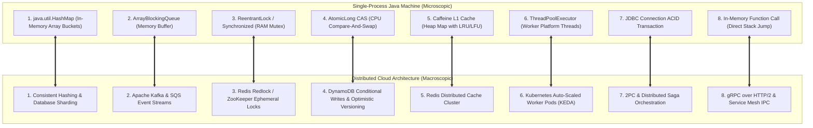

# Code-to-System Design Mental Models: The 8 Distributed Isomorphisms

---

## 1. What Is It?
The **Code-to-System Design Bridge** is the architectural framework that maps fundamental low-level programming language primitives (in-memory data structures, concurrency primitives, thread pools, and local transactions) to their exact distributed system design counterparts.

Distributed systems are not an entirely new paradigm; **distributed systems are simply single-process computer architecture scaled across a network of computers**.

---

## 2. Why Does It Exist?
Engineers frequently struggle with System Design interviews and large-scale architecture because they treat system design as an abstract memorization of buzzwords (Kafka, Redis, ZooKeeper, Sharding).

By understanding the **8 Distributed Isomorphisms**, you realize that you already know how distributed systems work because they operate on the exact same theoretical mechanics as single-process Java code:

---

## 3. Mental Model: The 8 Distributed Isomorphisms

---

## 4. The 8 Isomorphisms Detailed Breakdown

| # | Single-Process Primitive | Distributed System Counterpart | Shared Mechanical Principle |
|---|---|---|---|
| **1** | `java.util.HashMap` / Hash array | **Consistent Hashing / DB Sharding** | Partitioning keyspace via hash algorithms to locate data in $O(1)$. |
| **2** | `ArrayBlockingQueue` | **Apache Kafka / RabbitMQ** | Decoupling producer and consumer rates via bounded buffers. |
| **3** | `ReentrantLock` / `synchronized` | **Redis Redlock / ZooKeeper** | Enforcing mutual exclusion across concurrent execution units. |
| **4** | `AtomicLong.compareAndSet()` | **DynamoDB Conditional Put / Optimistic SQL** | Lock-free concurrency via atomic expected-version validation. |
| **5** | Caffeine L1 In-Memory Cache | **Distributed Redis Cluster** | Trading space for time via temporal and spatial locality. |
| **6** | `ThreadPoolExecutor` (4–64 threads) | **Kubernetes Worker Pods (KEDA)** | Distributing independent job payloads across parallel worker units. |
| **7** | JDBC `@Transactional` | **Distributed Sagas / Two-Phase Commit** | Coordinating multi-step state mutations to prevent partial failures. |
| **8** | In-Process Method Invocation | **gRPC over HTTP/2 / REST IPC** | Invoking subroutines with structured parameters and return values. |

---

## 5. Performance & Scaling Comparison

| Dimension | In-Process Execution | Distributed Network Execution | Failure Mode Difference |
|---|---|---|---|
| **Invocation Latency** | **$1 - 10\text{ nanoseconds}$** (CPU cache / RAM) | **$1 - 50\text{ milliseconds}$** (Network TCP) | $1,000,000\times$ slower; network latency cannot be ignored! |
| **Failure Guarantees** | Deterministic (Process is alive or dead) | **Partial Failures & Network Partitions** | Remote node may succeed while network drops response! |
| **Capacity Bound** | Bounded by single machine RAM/CPU | **Virtually Infinite (Horizontal Scale)** | Elastic scaling across thousands of nodes. |

---

## 6. Interview Questions

### Q1: In a System Design interview, how does explaining distributed architecture through the lens of single-process Java primitives demonstrate Senior/Staff level competence?

Reveal Answer

**Answer**:
Junior engineers describe distributed systems as a disjointed collection of third-party tools ("We put Redis here and Kafka there").
**Senior/Staff Engineers demonstrate mechanical mastery by connecting the dots**:
- *"Just as a `BlockingQueue` prevents a fast producer thread from overflowing memory by enforcing backpressure on a single machine, Apache Kafka acts as a distributed persistent blocking queue that prevents upstream HTTP traffic spikes from crashing downstream billing microservices."*
- *"Just as we use CAS (Compare-And-Swap) in `AtomicInteger` to avoid expensive OS mutex context switches on a single CPU, we use Optimistic Locking with version numbers in PostgreSQL to avoid holding table locks across distributed network transactions."*
This proves deep foundational understanding of computer science invariants that apply equally to 1 CPU core and a 10,000-node cloud cluster.

---

## 7. Quick Revision
- **Distributed Isomorphism**: Distributed architectures mirror single-process memory/thread patterns over networks.
- **HashMap $\to$ Sharding**: Keyspace hashing to distribute records.
- **BlockingQueue $\to$ Kafka**: Producer-consumer rate decoupling.
- **CAS $\to$ Optimistic Locking**: Lock-free version verification.
- **The Core Difference**: In-process calls take nanoseconds and are deterministic; distributed calls take milliseconds and suffer from **partial network failures**.
