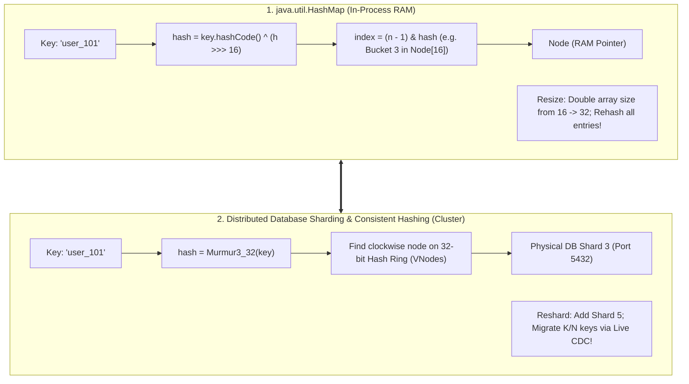

# From HashMap Internals to Consistent Hashing and Database Sharding

---

## 1. What Is It?
This lesson bridges the low-level data structures of **`java.util.HashMap`** (array buckets, hash functions, bitwise masking, collision resolution, and resizing rehashing) to macroscopic **Distributed Database Sharding and Consistent Hashing Rings**.

---

## 2. The Direct Architectural Mapping



---

## 3. Deep Dive Comparison

### 1. Index / Node Determination
- **In `HashMap`**:
  $$\text{bucketIndex} = (n - 1) \ \& \ \text{hash}$$
  *(Where $n$ is power of 2, e.g. 16, 32, 64)*.
- **In Hash-Based Database Sharding**:
  $$\text{shardIndex} = \text{Murmur3}(\text{PartitionKey}) \pmod N$$
  *(Where $N$ is total number of physical database shards)*.

---

### 2. Resizing vs Resharding

| Dimension | `java.util.HashMap` | Distributed Database Sharding |
|---|---|---|
| **Trigger** | `size > capacity * 0.75` (Load Factor) | Storage or write TPS exceeds single node capacity ($> 80\%$) |
| **Resizing Mechanism** | Allocates new `Node[newCapacity]` array ($2\times$) | Provisions new physical database server nodes |
| **Data Migration** | Iterates over old array, recalculates bucket indexes, and moves pointers in RAM | Streams data from old shards to new shards via **CDC / Consistent Hashing migration** |
| **Stop-The-World Impact** | Single-threaded GC pause or rehashing stall | Avoided via **Consistent Hashing (only $K/N$ keys move)** |

---

### 3. Collision Resolution: Red-Black Trees vs Cross-Shard Partition Keys
- **In `HashMap`**: When multiple keys hash to the same bucket:
  - If $\text{count} < 8 \longrightarrow$ Linked List chaining.
  - If $\text{count} \ge 8 \longrightarrow$ Treeified into a **Red-Black Balanced Tree** to guarantee $O(\log N)$ worst-case lookup.
- **In Distributed Sharding**: When multiple keys hash to the same shard:
  - The physical shard stores rows in its local **B+Tree storage engine (PostgreSQL/InnoDB)**.
  - If one key is disproportionately accessed (**Hot Key / Celebrity Problem**), it causes shard CPU saturation $\longrightarrow$ Mitigated via **Key Suffix Splitting (`key_#1 .. #10`)**.

---

## 4. Implementation: HashMap Logic vs Shard Router in Java 21

```java
package com.backend.engineering.bridge.hashing;

public class HashMappingBridgeDemo {

    // 1. Single-Process HashMap index calculation
    public static int calculateHashMapBucket(Object key, int tableLength) {
        int h = (key == null) ? 0 : (h = key.hashCode()) ^ (h >>> 16);
        return (tableLength - 1) & h;
    }

    // 2. Distributed Shard Index calculation
    public static int calculateDistributedShard(String partitionKey, int numShards) {
        long hash = hashMurmur3(partitionKey);
        return (int) (Math.abs(hash) % numShards);
    }

    private static long hashMurmur3(String key) {
        // Murmur3 hash implementation
        return key.hashCode() & 0xffffffffL;
    }
}
```

---

## 5. Interview Questions

### Q1: How does understanding HashMap rehashing help explain why Consistent Hashing is used in distributed databases instead of simple Modulo Sharding?
<details>
<summary>Reveal Answer</summary>

**Answer**:
1. **The In-Memory Rehashing Analogy**:
   - In a single-process `HashMap`, when the array reaches $75\%$ capacity, the JVM allocates a new array of double size and **rehashes every single existing entry**. In RAM, moving 100,000 pointers takes only $2\text{ milliseconds}$, which is acceptable.
2. **Why This Fails Across a Distributed Network**:
   - In a distributed database with 10 Terabytes of data across 4 servers, resizing to 5 servers using simple modulo hashing ($hash(key) \pmod N$) changes the denominator for $80\%$ of all records.
   - You would have to physically transmit **8 Terabytes of data over the network**, taking hours, saturating network switches, and causing total cache collapse.
3. **The Consistent Hashing Solution**:
   - Consistent Hashing maps nodes and keys to a 32-bit ring. Adding a 5th server remaps only **$1/5$ ($20\%$) of keys**, moving only data immediately adjacent to the new node on the ring while leaving the other $80\%$ untouched.
</details>

---

## 6. Quick Revision
- **The Isomorphism**: `HashMap` array buckets $\equiv$ Database physical shards.
- **Index Calculation**: Bitwise masking `(n-1) & hash` $\equiv$ Consistent hash ring traversal.
- **Rehashing**: In RAM it moves memory pointers; in distributed systems it requires network data migration.
- **Consistent Hashing**: Minimizes data migration to $K/N$ keys during cluster resizing.
