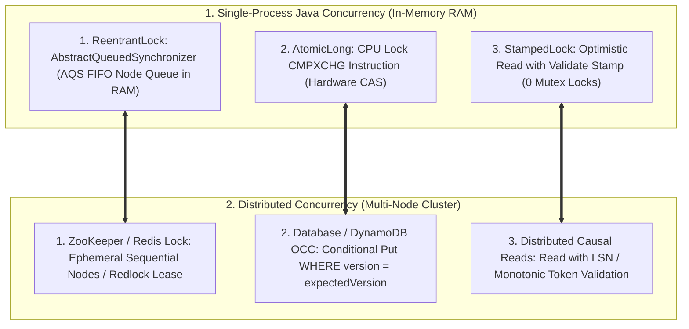
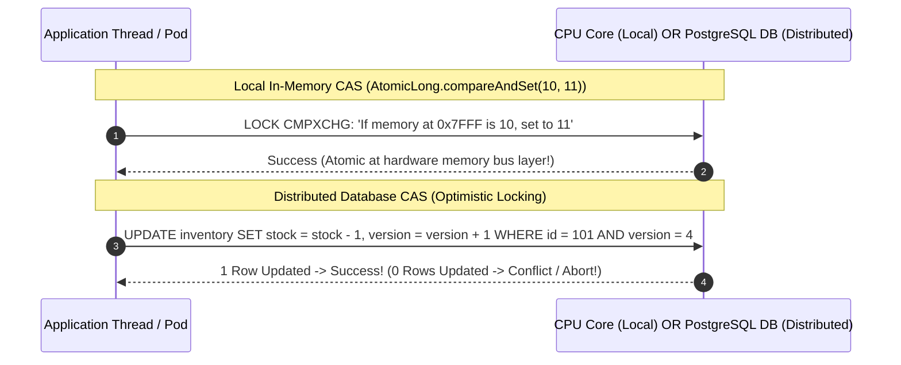

# From In-Memory Locks to Distributed Locks and Concurrency

---

## 1. What Is It?
This lesson bridges single-process Java concurrency primitives (**`synchronized`**, **`ReentrantLock` (AQS)**, **`StampedLock`**, and **`AtomicLong` CAS**) to their exact distributed counterparts (**Redis Redlock**, **ZooKeeper Ephemeral Locks**, **Raft Leases**, and **Distributed Optimistic Versioning**).

---

## 2. The Direct Architectural Mapping



---

## 3. Deep Dive Comparison

### 1. Lock Queueing: AQS vs ZooKeeper Ephemeral Sequential Nodes
- **In Java (`ReentrantLock`)**:
  - Threads competing for a lock are queued into a doubly linked FIFO queue inside the **AbstractQueuedSynchronizer (AQS)** in memory.
  - When the lock holder calls `unlock()`, it directly invokes `LockSupport.unpark()` on the head of the AQS queue.
- **In Distributed Systems (ZooKeeper Lock Recipe)**:
  - Clients competing for a lock create an **Ephemeral Sequential znode** in ZooKeeper (`/locks/resource-0000000001`, `/locks/resource-0000000002`).
  - The client with the lowest sequence number holds the lock.
  - Subsequent clients set a **Watch on the node immediately preceding them in sequence** (avoiding herd effect storms!). When node 1 is deleted, ZooKeeper notifies client 2 directly.

---

### 2. Lock-Free Concurrency: Hardware CAS vs Database Optimistic Locking



---

## 4. Implementation: Comparing Local CAS to Distributed CAS in Java 21

```java
package com.backend.engineering.bridge.concurrency;

import java.util.concurrent.atomic.AtomicLong;
import org.springframework.jdbc.core.JdbcTemplate;
import org.springframework.stereotype.Service;

@Service
public class ConcurrencyBridgeService {

    // 1. Single-Process Lock-Free Atomic CAS
    private final AtomicLong localAccountBalance = new AtomicLong(1000L);

    public boolean updateLocalBalance(long expectedCurrent, long newBalance) {
        // Direct CPU hardware CAS instruction: LOCK CMPXCHG
        return localAccountBalance.compareAndSet(expectedCurrent, newBalance);
    }

    // 2. Distributed Lock-Free Atomic CAS (Database Optimistic Locking)
    private final JdbcTemplate jdbcTemplate;

    public ConcurrencyBridgeService(JdbcTemplate jdbcTemplate) {
        this.jdbcTemplate = jdbcTemplate;
    }

    public boolean updateDistributedBalance(Long accountId, long newBalance, long expectedVersion) {
        String sql = """
            UPDATE accounts 
            SET balance = ?, version = version + 1 
            WHERE id = ? AND version = ?
        """;

        int rowsAffected = jdbcTemplate.update(sql, newBalance, accountId, expectedVersion);
        return rowsAffected == 1; // Atomic lock-free CAS across distributed cluster!
    }
}
```

---

## 5. Performance & Overhead Comparison

| Concurrency Pattern | Local In-Memory Latency | Distributed Network Latency | Deadlock Vulnerability |
|---|---|---|---|
| **Pessimistic Mutex / Lock** | **$\approx 15 - 50\text{ nanoseconds}$** | **$2 - 15\text{ milliseconds}$** | High (Requires timeout/lease watchdog) |
| **Optimistic CAS** | **$\approx 2\text{ nanoseconds}$ (Single CPU cycle)**| **$1 - 3\text{ milliseconds}$ (Single SQL UPDATE)** | **Zero (Lock-free / Fail fast)** |

---

## 6. Interview Questions

### Q1: Why is Optimistic Locking preferred over Distributed Pessimistic Locking (e.g. Redlock) for high-throughput ecommerce checkouts?
<details>
<summary>Reveal Answer</summary>

**Answer**:
1. **Pessimistic Distributed Locks (Redlock / ZooKeeper)**:
   - Require multiple network roundtrips to acquire, maintain heartbeat leases, and release the lock across distributed nodes ($10 - 30\text{ms}$).
   - If a worker pod experiences a GC pause or network hiccup, the lock lease may expire prematurely, leading to race conditions where two pods believe they hold the lock simultaneously.
2. **Optimistic Locking with Database Version CAS**:
   - Requires zero upfront lock acquisition.
   - The worker executes business logic in memory and submits a single atomic conditional SQL statement:
     $$\texttt{UPDATE inventory SET stock = stock - 1, version = version + 1 WHERE sku = 'PS5' AND version = 42 AND stock > 0;}$$
   - The database engine evaluates the version condition atomically on the disk page. If a conflict occurs, the statement fails instantly in $< 1\text{ms}$ with zero deadlock risk and zero distributed lease management overhead.
</details>

---

## 7. Quick Revision
- **The Isomorphism**: AQS FIFO queues $\equiv$ ZooKeeper Ephemeral Sequential znodes.
- **CPU CAS $\equiv$ Database Optimistic Locking**: Both use atomic conditional version checks to achieve lock-free concurrency.
- **Lease Expiration Hazard**: Distributed locks must use heartbeat watchdogs (e.g. Redisson) to prevent premature lease expiration during GC pauses.
- **Prefer Optimistic in Distributed Systems**: Eliminates distributed deadlock states and minimizes network round-trips.
