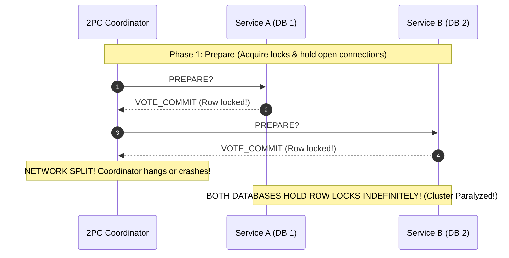
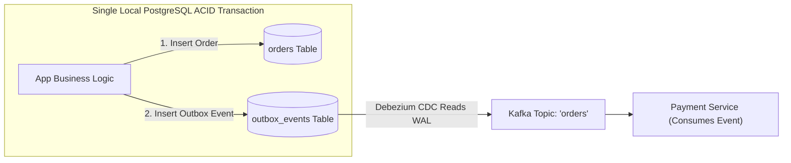

# From Local ACID Transactions to Distributed Sagas and 2PC

---

## 1. What Is It?
This lesson bridges single-database **Local ACID Transactions** (managed via Spring `@Transactional` and JDBC connection boundaries) to multi-service **Distributed Transactions** (Two-Phase Commit / 2PC and Orchestrated/Choreographed Sagas with Compensating Actions).

---

## 2. The Direct Architectural Mapping

```mermaid
flowchart TD
    subgraph LocalACID["1. Local Transaction (@Transactional - Single Database)"]
        Begin["1. Begin JDBC Connection Tx"]
        Write1["2. INSERT INTO orders ..."]
        Write2["3. UPDATE inventory ..."]
        Commit["4. DB Commit WAL / Auto-Rollback on Exception"]
        Note over LocalACID: Single DB connection; ACID enforced atomically on 1 physical disk!
    end

    subgraph DistributedSaga["2. Distributed Saga (Across 3 Microservices)"]
        Step1["1. Order Service: Create Order (PENDING) -> Emit Event"]
        Step2["2. Payment Service: Charge Card (FAILED!)"]
        Compensate["3. Compensating Action: Order Service cancels order & restores stock!"]
        Note over DistributedSaga: Eventual Consistency! Compensating transactions undo partial steps!
    end

    LocalACID <===> DistributedSaga
```

---

## 3. Deep Dive Comparison

### 1. Why Two-Phase Commit (2PC / XA) Fails at Scale



- **The 2PC Flaw**: 2PC is a **Blocking Protocol**. If the coordinator fails during the prepare phase, participating database shards must **hold row locks indefinitely**, causing database connection starvation and catastrophic latency spikes.

---

### 2. The Production Standard: Sagas with Compensating Actions
Instead of holding distributed database locks across network boundaries:
1. Each microservice executes a **local ACID transaction** in its own database and immediately commits.
2. If Step 3 fails (e.g. Payment Declined):
   - The Saga Coordinator dispatches **Compensating Transactions (Undo Actions)** backwards to revert previous steps:
     - `OrderService.cancelOrder()`
     - `InventoryService.releaseStock()`

---

## 4. The Outbox Pattern: Bridging Local DB Commit to Distributed Events

$$\textbf{The Distributed Invariant: } \text{You cannot atomically write to a Database and publish to Kafka in the same line of code!}$$



---

## 5. Implementation: Saga Orchestrator State Machine in Java 21

```java
package com.backend.engineering.bridge.sagas;

import org.slf4j.Logger;
import org.slf4j.LoggerFactory;
import org.springframework.stereotype.Service;

@Service
public class OrderSagaOrchestrator {

    private static final Logger log = LoggerFactory.getLogger(OrderSagaOrchestrator.class);

    private final OrderLocalService orderService;
    private final PaymentRemoteClient paymentClient;
    private final InventoryRemoteClient inventoryClient;

    public OrderSagaOrchestrator(OrderLocalService orderService, 
                                 PaymentRemoteClient paymentClient, 
                                 InventoryRemoteClient inventoryClient) {
        this.orderService = orderService;
        this.paymentClient = paymentClient;
        this.inventoryClient = inventoryClient;
    }

    public void executeCreateOrderSaga(Long orderId, Long userId, Long amountCents, String sku) {
        // Step 1: Local DB Transaction (Create PENDING order)
        orderService.createPendingOrder(orderId, userId);
        log.info("Saga Step 1 Success: Order {} created in PENDING state", orderId);

        // Step 2: Reserve Inventory
        boolean inventoryReserved = inventoryClient.reserveInventory(orderId, sku);
        if (!inventoryReserved) {
            log.error("Saga Step 2 Failed: Out of stock! Executing Compensation...");
            orderService.cancelOrder(orderId, "OUT_OF_STOCK");
            return;
        }

        // Step 3: Process Payment
        boolean paymentSuccess = paymentClient.chargePayment(orderId, userId, amountCents);
        if (!paymentSuccess) {
            log.error("Saga Step 3 Failed: Payment Declined! Executing Compensations...");
            // COMPENSATING TRANSACTIONS:
            inventoryClient.releaseInventory(orderId, sku); // Compensate Step 2
            orderService.cancelOrder(orderId, "PAYMENT_DECLINED"); // Compensate Step 1
            return;
        }

        // Step 4: Finalize Order
        orderService.markOrderActive(orderId);
        log.info("Saga Completed Successfully for Order {}", orderId);
    }
}
```

---

## 6. Performance & ACID vs BASE Comparison

| Dimension | Local ACID Transaction | Distributed 2PC (XA) | Distributed Sagas (BASE) |
|---|---|---|---|
| **Consistency** | Strict Linearizability | Strict Linearizability | **Eventual Consistency** |
| **Throughput (TPS)** | **High ($5,000+\text{ TPS}$)** | **Abysmal ($< 50\text{ TPS}$)** | **Ultra-High ($100,000+\text{ TPS}$)** |
| **Lock Holding Duration** | Microseconds | **Seconds (Network roundtrips)** | **Microseconds (Local transactions)** |
| **Availability (CAP)** | High (Single node) | Low (Multiplicative failure) | **High (Partition tolerant)** |

---

## 7. Interview Questions

### Q1: Why is Two-Phase Commit (2PC) considered an anti-pattern for microservices, and why are Sagas preferred?
<details>
<summary>Reveal Answer</summary>

**Answer**:
1. **2PC (Tight Coupling & Availability Collapse)**:
   - 2PC requires all participating database nodes to hold row locks across the entire network voting phase.
   - If one service is slow, all other services' database connections remain blocked.
   - **Multiplicative Availability Loss**: If 4 microservices each have $99.9\%$ availability, a 2PC transaction spanning all 4 has an availability of $(0.999)^4 = 99.6\%$, violating high availability requirements.
2. **Sagas (Loose Coupling & Eventual Consistency)**:
   - Break the multi-service transaction into a series of **independent local ACID transactions**.
   - Each local transaction acquires locks for only a few milliseconds and commits immediately.
   - If a subsequent step fails, asynchronous **Compensating Transactions** are executed to undo earlier steps, preserving high availability, elastic throughput, and horizontal scalability.
</details>

---

## 8. Quick Revision
- **Local ACID**: Single DB connection commits to 1 disk atomically.
- **2PC Anti-Pattern**: Blocking protocol holding distributed locks across networks.
- **Sagas**: Series of local transactions coordinated with compensating undo actions.
- **Outbox Pattern**: Atomically saves business entity and event in the same local DB transaction.
- **Eventual Consistency**: Replaces distributed locking with asynchronous state reconciliation.
