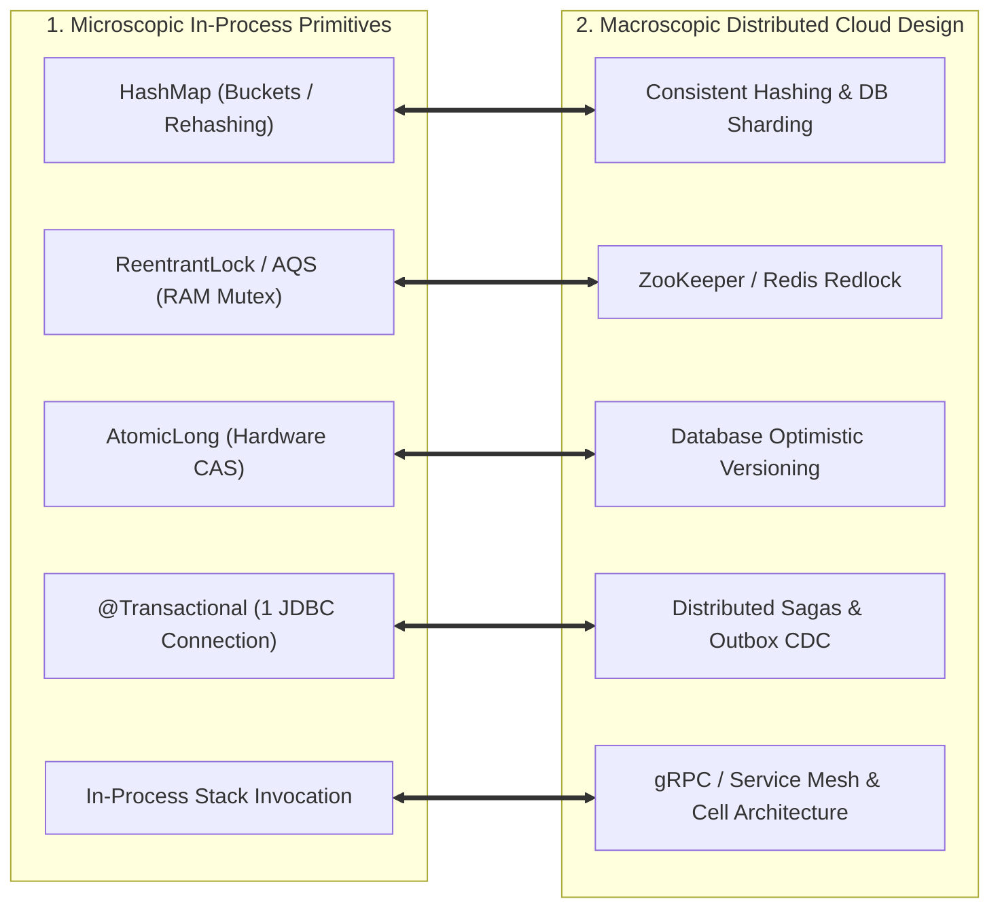

# Module 31: System Design Bridge (From Code to System Design)

Master the mental models bridging microscopic low-level Java/JVM code to macroscopic distributed cloud system design: The 8 Distributed Isomorphisms, mapping `java.util.HashMap` internals to Database Sharding and Consistent Hashing rings, in-memory `ReentrantLock` & `AtomicLong` CAS to Redis Redlocks and Database Optimistic Concurrency Control, single-node `@Transactional` JDBC boundaries to Distributed Sagas & 2PC, and the evolution from Monoliths to Microservices and Cell-Based Architectures.

---

## 🗺️ Master Code-to-System Design Isomorphism Map

---

## 📚 Curriculum Lessons

| # | Lesson | Core Focus & Mechanics |
|:---:|---|---|
| **01** | [`01-code-to-system-design-mental-models.md`](./01-code-to-system-design-mental-models.md) | The 8 Distributed Isomorphisms: how low-level data structures and memory models scale across network topologies. |
| **02** | [`02-from-hashmap-to-consistent-hashing-and-sharding.md`](./02-from-hashmap-to-consistent-hashing-and-sharding.md) | `HashMap` bitwise masking `(n-1) & hash` and rehashing $\longrightarrow$ Consistent Hashing rings with VNodes. |
| **03** | [`03-from-threads-and-locks-to-distributed-concurrency.md`](./03-from-threads-and-locks-to-distributed-concurrency.md) | AQS FIFO lock queues and CPU CAS $\longrightarrow$ ZooKeeper ephemeral locks and database optimistic locking. |
| **04** | [`04-from-local-transactions-to-sagas-and-2pc.md`](./04-from-local-transactions-to-sagas-and-2pc.md) | Local JDBC transactions, why 2PC blocks across networks, and Orchestrated Sagas with Outbox CDC. |
| **05** | [`05-from-monolith-to-microservices-and-cell-based-architecture.md`](./05-from-monolith-to-microservices-and-cell-based-architecture.md) | Monoliths $\longrightarrow$ Microservices $\longrightarrow$ Cell-Based Architectures for blast radius containment. |

---

## ⚡ Key Production Takeaways

1. **Distributed Systems Are Not Magic**: Distributed systems operate on the exact same theoretical mechanics as single-process CPU and memory architectures, scaled over physical network cables.
2. **Prefer Optimistic Over Pessimistic**: Lock-free CAS with database version numbers eliminates distributed deadlock hazards and minimizes network round-trips.
3. **Use Sagas, Not 2PC**: Avoid holding distributed database locks across networks; use Sagas with compensating undo actions.
4. **Outbox Pattern for Atomicity**: You cannot atomically write to a DB and publish to Kafka in the same line of code; use the Transactional Outbox pattern.
5. **Cell-Based Architecture Caps Blast Radius**: Partition hyper-scale platforms into autonomous cells to limit outages to $1/N$ fraction of users.
