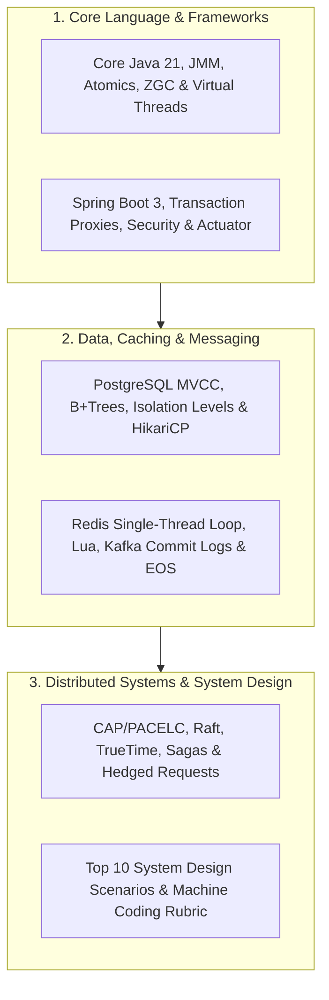

# Module 32: Senior Backend Interview Preparation Bank

Master senior backend and distributed systems interviews: 300+ in-depth interview questions across Core Java 21 & JMM internals, Spring Boot 3 auto-configuration & transaction proxies, Database internals & MVCC concurrency, Redis caching & Kafka distributed commit logs, Distributed consensus & PACELC theorems, and 10 end-to-end System Design & Machine Coding blueprints.

---

## 🗺️ Master Interview Preparation Domain Matrix

---

## 📚 Interview Question Banks

| # | Topic Area | Question Bank Document | Core Concepts Tested |
|:---:|---|---|---|
| **01** | **Core Java & JVM** | [`01-core-java-and-jvm-interview-qa.md`](./01-core-java-and-jvm-interview-qa.md) | JMM happens-before, `volatile`, Generational ZGC, Virtual Threads pinning, `LongAdder`, and `CompletableFuture`. |
| **02** | **Spring Boot Internals** | [`02-spring-boot-internals-interview-qa.md`](./02-spring-boot-internals-interview-qa.md) | `@Transactional` self-invocation traps, `@Conditional` auto-config, Security Filter Chain, `RestClient`, and Graceful Shutdown. |
| **03** | **Databases & Concurrency**| [`03-database-internals-and-concurrency-qa.md`](./03-database-internals-and-concurrency-qa.md) | B+Trees vs LSM-Trees, MVCC dead tuples, Write Skew anomaly, HikariCP sizing math, and `EXPLAIN BUFFERS`. |
| **04** | **Caching & Messaging** | [`04-caching-redis-and-messaging-kafka-qa.md`](./04-caching-redis-and-messaging-kafka-qa.md) | Redis single-thread event loop, Cache Penetration/Avalanche, Kafka Zero-Copy `sendfile()`, and Exactly-Once Semantics (EOS). |
| **05** | **Distributed Systems** | [`05-distributed-systems-and-microservices-qa.md`](./05-distributed-systems-and-microservices-qa.md) | PACELC theorem, Raft quorum election, Google TrueTime vs Vector Clocks, Snowflake IDs, and Jeff Dean Hedged Requests. |
| **06** | **System Design & LLD** | [`06-system-design-and-machine-coding-prompts.md`](./06-system-design-and-machine-coding-prompts.md) | Top 10 System Design scenarios (Rate Limiter, URL Shortener, Flash Sale, Chat, Scheduler) + Machine Coding Rubric. |

---

## ⚡ How to Prepare for Senior Backend Interviews

1. **Focus on Mechanical Reality**: Never answer with generic definitions. Always explain the underlying physics (e.g. CPU cache lines, OS epoll loops, Linux page cache, or database WAL page latches).
2. **Quantify Sizing Math**: Always be ready to calculate QPS, storage growth per year, network bandwidth, and memory footprints during System Design interviews.
3. **Connect Code to Architecture**: Frame high-level distributed patterns through their single-process computer science equivalents (e.g. CAS $\leftrightarrow$ Optimistic Versioning; HashMap $\leftrightarrow$ Consistent Hashing).
4. **Demonstrate Failure Awareness**: Top-tier interviewers look for engineers who design for failure: connection pool exhaustion, poison pills, replication lag, and network partitions.
