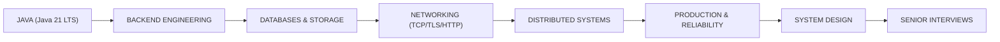
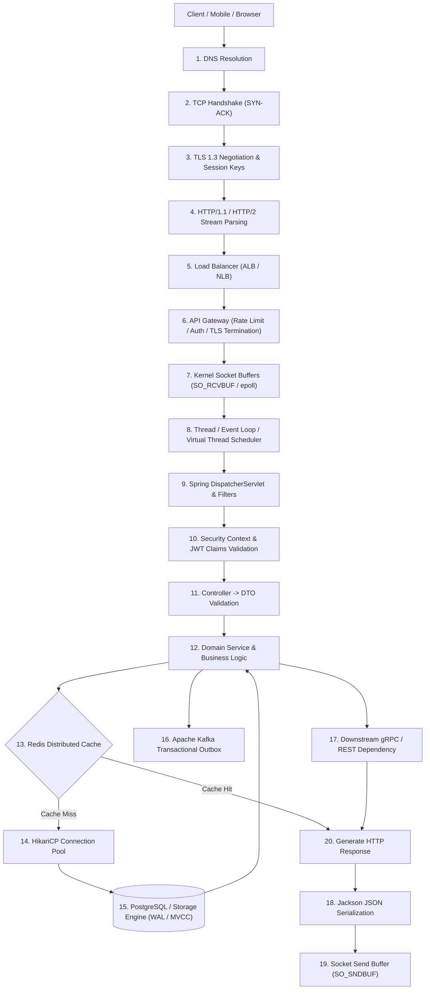

# Backend Engineering: SDE2 & Senior Backend Systems Curriculum

An implementation-first backend engineering curriculum engineered for **SDE2, Senior Backend Engineers, Java Backend Engineers, and System Design Interview Preparation**.

---

## 🌉 The Backend Engineering Bridge

---

## ⚡ The End-to-End Request Lifecycle

This repository deconstructs what happens across the entire backend request lifecycle, exploring both happy paths and pathological failure modes:

### Component Failure & Overload Modes Explored
- **Slowdowns & Latency Inflation**: GC pause spikes, unindexed B+Tree scans, database locks, slow downstream dependencies.
- **Overload & Resource Exhaustion**: 100% CPU spikes, heap memory leaks (`OutOfMemoryError`), HikariCP connection starvation, thread pool queue saturation.
- **Network Failures**: Packet loss, TCP connection resets, TLS handshake timeouts, DNS TTL caching bugs.
- **Concurrency & Backpressure**: Unbounded queue buffer bloat, retry storms, cascading circuit breaker trips.

---

## 🎯 Target Technical Baseline & Standards

- **Primary Language**: Java 21 LTS (`Amazon Corretto` / `Eclipse Temurin`)
- **Build System**: Apache Maven 3.9+
- **Spring Boot Baseline**: **`3.3.4`** (Pinned stable Java 21 LTS release)
- **Testing Standard**: JUnit 5, Mockito 5, Testcontainers 1.19+ (Fast Tier vs Integration Tier)
- **Databases**: PostgreSQL 16, MySQL 8, Redis 7.2, DynamoDB concepts, MongoDB concepts
- **Messaging**: Apache Kafka 3.7+ (KRaft mode), AWS SQS concepts
- **Observability**: OpenTelemetry, Micrometer, Prometheus, W3C Trace Context
- **Containers & Orchestration**: Docker, Docker Compose, Kubernetes 1.30+

---

## 🧪 Test Execution Tiers

To ensure rapid developer feedback without compromising distributed integration fidelity:

| Test Tier | Command | Scope | Container Dependency |
|---|---|---|:---:|
| **Fast Tier** | `mvn test` | Pure unit tests, domain logic, Mockito mocks | ❌ Zero Docker |
| **Integration Tier** | `mvn verify -Pintegration` | PostgreSQL, Redis, Kafka Testcontainers (`*IT.java`) | ✅ Docker Required |

---

## 🏛️ Repository Boundaries & Cross-Repository Synergies

| Repository | Scope & Ownership |
|---|---|
| **`backend-engineering`** (This Repo) | **Single-service deep dive**: Implementation details, request lifecycle, failure handling, service-level performance, operational debugging, backend code, connection pools. |
| **`system-design-interview`** | **Multi-service architecture**: Composing $N$ services, global capacity estimations, cross-datacenter replication, end-to-end distributed system design. |
| **`java-interview-preparation`** | **Language & JVM internals**: JLS language semantics, HotSpot JVM bytecode, JMM memory barriers, deep garbage collector mechanics. |

---

## 📚 32-Module Curriculum Directory

| # | Directory | Topic Area |
|:---:|---|---|
| **01** | [`01-backend-fundamentals/`](./01-backend-fundamentals/) | Stateless vs Stateful, CPU vs IO-bound, Latency vs Throughput vs Concurrency |
| **02** | [`02-http-and-apis/`](./02-http-and-apis/) | HTTP/1.1 vs HTTP/2 vs HTTP/3, Keep-Alive, Content Negotiation, Compression |
| **03** | [`03-request-lifecycle/`](./03-request-lifecycle/) | **Flagship Lesson**: End-to-end request traversal from Client socket to Database |
| **04** | [`04-networking-for-backend/`](./04-networking-for-backend/) | DNS resolution, TCP 3-way handshake, TLS 1.3 negotiation, socket buffers |
| **05** | [`05-api-design/`](./05-api-design/) | RESTful modeling, Idempotency keys, Pagination, Versioning, Error formats |
| **06** | [`06-authentication-and-security/`](./06-authentication-and-security/) | JWT, OAuth2, OIDC, RBAC/ABAC, CORS/CSRF, SQL Injection, Replay attack defense |
| **07** | [`07-databases/`](./07-databases/) | Relational modeling, Indexes, JDBC connection pools, JPA/Hibernate integration |
| **08** | [`08-database-internals/`](./08-database-internals/) | B+Tree storage engines, Buffer Pools, WAL, MVCC, Query execution planners |
| **09** | [`09-transactions-and-consistency/`](./09-transactions-and-consistency/) | ACID anomalies, 4 Isolation levels, Pessimistic vs Optimistic locking, Sagas |
| **10** | [`10-caching/`](./10-caching/) | Cache-Aside, Write-Through, Redis data structures, Redisson distributed locks |
| **11** | [`11-messaging/`](./11-messaging/) | Apache Kafka KRaft, Partitions, Consumer groups, Offsets, Delivery semantics |
| **12** | [`12-event-driven-architecture/`](./12-event-driven-architecture/) | Event Sourcing, Transactional Outbox pattern, Debezium CDC, Schema evolution |
| **13** | [`13-distributed-systems/`](./13-distributed-systems/) | CAP/PACELC, Distributed locks, Snowflake IDs, Vector clocks, Failure detectors |
| **14** | [`14-resilience/`](./14-resilience/) | Circuit Breakers, Bulkheads, Exponential backoff with jitter, Rate limiting |
| **15** | [`15-concurrency-and-backpressure/`](./15-concurrency-and-backpressure/) | Virtual Threads (JEP 444), Thread pool exhaustion, Reactive backpressure |
| **16** | [`16-observability/`](./16-observability/) | Structured logging, Prometheus RED/USE metrics, W3C OpenTelemetry tracing |
| **17** | [`17-performance/`](./17-performance/) | p50/p90/p99/p99.9 latency analysis, GC profiling, Connection pool optimization |
| **18** | [`18-scalability/`](./18-scalability/) | Horizontal scaling, Database read replicas, Consistent hashing, DB sharding |
| **19** | [`19-microservices/`](./19-microservices/) | Bounded contexts, Monolith vs Microservices trade-offs, Service discovery |
| **20** | [`20-service-to-service-communication/`](./20-service-to-service-communication/) | REST vs gRPC (Protobuf) vs Kafka vs SQS trade-off comparisons |
| **21** | [`21-background-jobs/`](./21-background-jobs/) | Task queues, Visibility timeouts, Distributed schedulers, Job leasing |
| **22** | [`22-file-and-object-storage/`](./22-file-and-object-storage/) | S3 multipart upload, Pre-signed URLs, CDN edge caching, Checksum integrity |
| **23** | [`23-search/`](./23-search/) | Inverted index architecture, Tokenizers, Analyzers, Database vs Search engine |
| **24** | [`24-real-time-systems/`](./24-real-time-systems/) | WebSocket connection management, Server-Sent Events (SSE), Long polling |
| **25** | [`25-cloud-backend/`](./25-cloud-backend/) | AWS cloud backend architecture (ALB, ECS, RDS, ElastiCache, MSK, SQS) |
| **26** | [`26-containers-and-kubernetes/`](./26-containers-and-kubernetes/) | Docker multi-stage builds, K8s Pods, Deployments, Probes, HPA, Graceful stop |
| **27** | [`27-production-engineering/`](./27-production-engineering/) | Canary deployments, Blue/Green, Zero-downtime DB migrations, SEV-1 postmortems |
| **28** | [`28-testing/`](./28-testing/) | Fast-tier unit testing, Integration testing with Testcontainers, Contract tests |
| **29** | [`29-backend-projects/`](./29-backend-projects/) | **15 Runnable Backend Projects** (Rate Limiter, Idempotent Payment, URL Shortener) |
| **30** | [`30-debugging/`](./30-debugging/) | **20 Production Debugging Scenarios** (100% CPU, OOM, Pool starvation, Kafka lag) |
| **31** | [`31-system-design-bridge/`](./31-system-design-bridge/) | Mapping backend implementations to System Design building blocks & case studies |
| **32** | [`32-interview/`](./32-interview/) | **300+ Original SDE2 / Senior Backend Interview Questions** across 15 categories |
