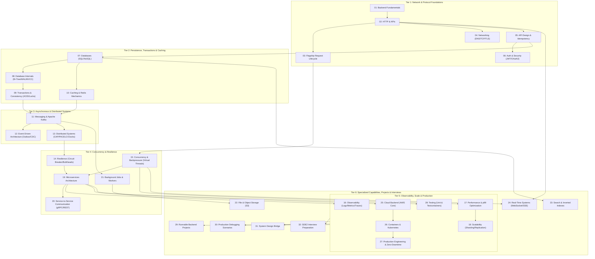

# Backend Engineering Curriculum Dependency Graph

Visualizing the prerequisite relationships, architectural bridges, and progressive mastery paths across all 32 curriculum modules.

---

## 🗺️ Architectural Mastery Graph

