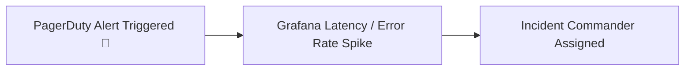

# Production Incident: [Incident Title]

---

## 1. Incident Overview
- **Severity**: SEV-1 / SEV-2
- **Component**: [e.g. HikariCP Connection Pool / Kafka Consumer / Redis Cache]
- **Symptoms**: [Latency spike, 504 Gateway Timeouts, 100% CPU, Memory leak]

---

## 2. Initial Signals & Symptoms


---

## 3. Metrics, Logs, and Traces
### Prometheus Metrics
```text
http_server_requests_seconds_count{status="500"} -> Spiked by 400%
hikaricp_pending_threads{pool="MasterPool"} -> 48 threads blocked
```

### Structured Logs
```json
{
  "timestamp": "2026-09-01T18:00:00Z",
  "level": "ERROR",
  "trace_id": "4bf92f3577b34da6a3ce929d0e0e4736",
  "message": "Connection is not available, request timed out after 30000ms."
}
```

---

## 4. Hypotheses & Diagnostic Investigation
1. **Hypothesis 1**: Database server CPU saturation.
   - *Test*: Query `pg_stat_activity` -> DB CPU at 15%. (Disproven)
2. **Hypothesis 2**: Slow queries holding connections.
   - *Test*: Query `pg_stat_activity` where state = 'active' -> Unindexed sequential scan holding transaction. (Confirmed)

---

## 5. Root Cause Analysis (5 Whys)
1. Why did requests time out? -> HikariCP pool exhausted.
2. Why was the pool exhausted? -> Threads held connections for 15s instead of 5ms.
3. Why did queries take 15s? -> An unindexed `ORDER BY created_at` performed a disk filesort.
4. Why was the index missing? -> The migration was skipped in the previous release pipeline.
5. Why was it skipped? -> The CI/CD lacked pre-deployment schema validation.

---

## 6. Immediate Mitigation & Recovery
- Deployed a hotfix adding the composite index `CREATE INDEX CONCURRENTLY idx_orders_created`.
- Restored pool queue latency from 30,000ms to 4ms.

---

## 7. Permanent Fix & Preventative Engineering
- Added automated schema verification to the deployment gate.
- Configured HikariCP leak detection threshold: `spring.datasource.hikari.leak-detection-threshold=5000`.
