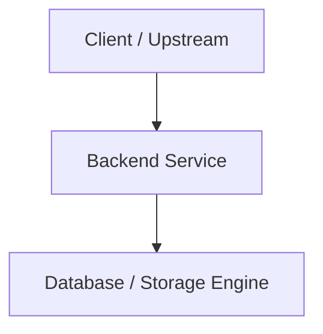

# [Topic Title]

---

## 1. What Is It?
[High-level technical definition and core concept overview]

## 2. Why Does It Exist?
[The architectural or engineering problem it solves; what fails without it]

## 3. Mental Model


## 4. How Does It Work?
[Step-by-step technical lifecycle and core mechanisms]

## 5. Internal Working
[Deep dive into protocols, kernel buffers, data structures, and memory management]

## 6. Example
[Conceptual code snippet or concrete real-world operational scenario]

## 7. Implementation
```java
package com.backend.engineering;

public class ExampleService {
    // Production-grade Java 21 LTS idiomatic code
}
```

## 8. Performance
[Latency profiles (p50/p90/p99/p99.9), throughput limits, CPU/memory/IO complexity]

## 9. Failure Scenarios
- **Failure Mode 1**: [Description, blast radius, mitigation]
- **Failure Mode 2**: [Description, blast radius, mitigation]

## 10. Observability
- **Metrics**: [RED/USE metrics: `http_requests_total`, `latency_seconds`]
- **Logs**: [Structured JSON logs with correlation IDs]
- **Traces**: [W3C traceparent propagation across boundaries]

## 11. Debugging
[Step-by-step command-line and profiling triage runbook]

## 12. Scaling
[Vertical vs horizontal scaling, partitioning, read/write replication]

## 13. Trade-offs
| Approach | Pros | Cons | Best Suited For |
|---|---|---|---|
| Approach A | Fast, low complexity | Eventual consistency | High-read workloads |
| Approach B | Strict consistency | Higher write latency | Financial ledgers |

## 14. When to Use
[Production use cases and concrete scenarios]

## 15. When NOT to Use
[Scenarios where this introduces anti-patterns or unnecessary overhead]

## 16. Interview Questions
### Q1: [High-frequency SDE2 technical interview question]
<details>
<summary>Reveal Answer</summary>

**Answer**: [Deep technical answer with architectural rationale and trade-offs]
</details>

## 17. Practical Exercise
[Hands-on implementation drill or profiling assignment]

## 18. Quick Revision
- [Bullet 1]
- [Bullet 2]
- [Bullet 3]
