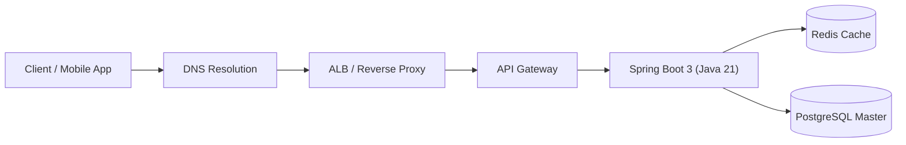
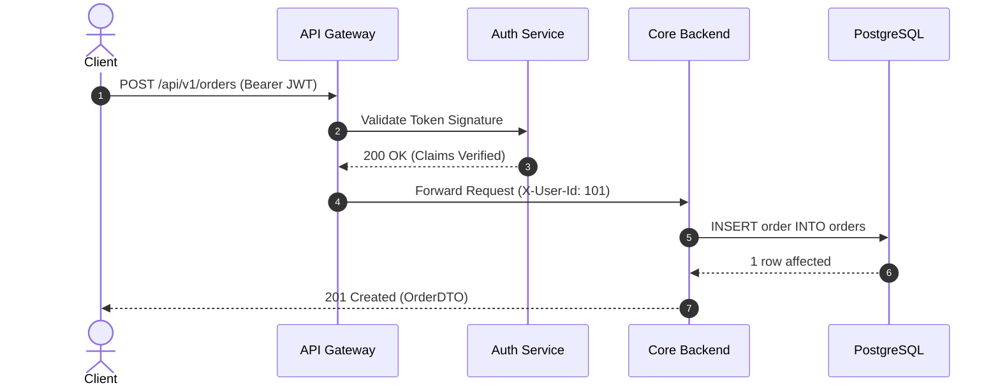
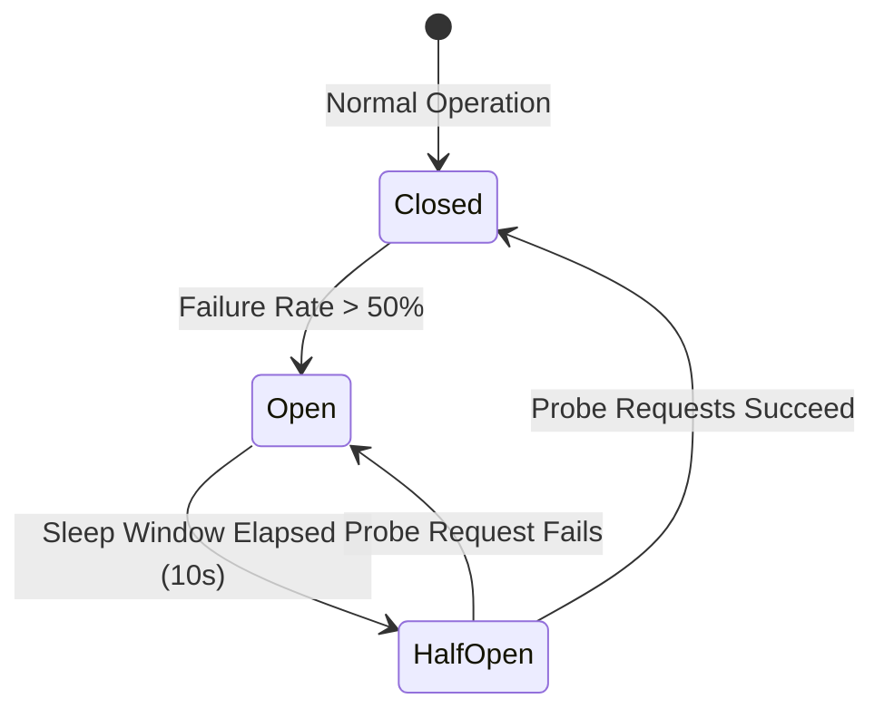

# Technical Diagram Standards (Mermaid)

All technical documentation in this repository must use clean, unambiguous, and renderer-safe Mermaid syntax.

---

## 📐 Supported Diagram Types

### 1. Request Lifecycles & Architecture (`flowchart TD` / `flowchart LR`)

### 2. Service Protocol & Handshake Sequences (`sequenceDiagram`)

### 3. State Machines (`stateDiagram-v2`)

