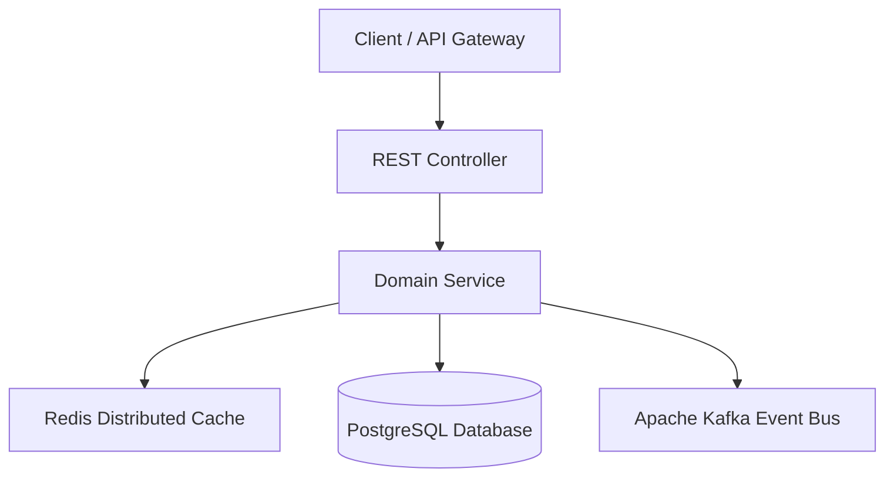

# Project: [Project Title]

---

## 1. Requirements & Scope
### Functional Requirements
- Requirement 1
- Requirement 2

### Non-Functional Requirements
- **Latency**: p99 $< 20\text{ms}$
- **Throughput**: $10,000\text{ req/sec}$
- **Availability**: 99.99% uptime
- **Consistency**: Strong consistency for mutations, eventual for telemetry.

---

## 2. System Architecture


---

## 3. API Specification
```http
POST /api/v1/resource
Content-Type: application/json
Idempotency-Key: 7b841804-d421-4f11-9a7c-619f727c9d92

{
  "id": "res_1001",
  "name": "Production Resource"
}
```

---

## 4. Data Model & Schema
```sql
CREATE TABLE resources (
    id VARCHAR(64) PRIMARY KEY,
    name VARCHAR(255) NOT NULL,
    version BIGINT NOT NULL DEFAULT 0,
    created_at TIMESTAMP WITH TIME ZONE DEFAULT CURRENT_TIMESTAMP
);
CREATE INDEX idx_resources_created ON resources (created_at DESC);
```

---

## 5. Implementation
- **Tech Stack**: Java 21 LTS, Spring Boot 3.3.4, HikariCP, Redis, Kafka.
- **Progression**:
  - **V1 (Simple Correct Implementation)**: In-memory baseline semantics.
  - **V2 (Production Improvements)**: Connection pools, timeouts, retries, metrics.
  - **V3 (Distributed / Scaled Version)**: Distributed cache, messaging, idempotency.

---

## 6. Testing & Quality Verification
- **Fast Tier (`mvn test`)**: Pure unit tests, domain logic, Mockito mocks ($< 5\text{s}$, zero Docker).
- **Integration Tier (`mvn verify -Pintegration`)**: Container-backed integration tests via Testcontainers (`*IT.java` with real PostgreSQL/Redis/Kafka).

---

## 7. Failure Scenarios & Edge Cases
- Downstream dependency timeouts and circuit breaker state transitions.
- Database connection pool exhaustion and backpressure shed.
- Transient network partition and idempotency retry deduplication.

---

## 8. Observability
- **Metrics**: Micrometer Prometheus RED metrics (`http_server_requests_seconds_count`, `hikaricp_pending_threads`).
- **Structured Logs**: Logback JSON encoder with MDC `trace_id` and `span_id`.
- **Distributed Tracing**: OpenTelemetry W3C Trace Context headers (`traceparent`).

---

## 9. Scaling Considerations
- Horizontal scaling with stateless app instances.
- Read replicas for high-throughput query offloading.
- Partition key strategy for Kafka topic scaling.

---

## 10. Performance
- Benchmarking setup (e.g., k6 / JMeter / Gatling).
- Target latency profile: p50 $< 5\text{ms}$, p90 $< 12\text{ms}$, p99 $< 20\text{ms}$, p99.9 $< 45\text{ms}$.

---

## 11. Trade-offs
| Architectural Choice | Trade-off / Benefit | Limitation / Cost |
|---|---|---|
| In-Memory Cache vs Redis | Sub-millisecond latency | Cache invalidation drift across nodes |
| Synchronous REST vs Kafka Outbox | Immediate client feedback | Higher coupling, cascade failure risk |

---

## 12. SDE2 / Senior Interview Questions
### Q1: How does this service handle concurrent duplicate requests with the same Idempotency-Key?
<details>
<summary>Reveal Answer</summary>

**Answer**: Uses Redis distributed locks or PostgreSQL unique constraint on `idempotency_key` with optimistic locking and status tracking (`IN_PROGRESS`, `COMPLETED`).
</details>
