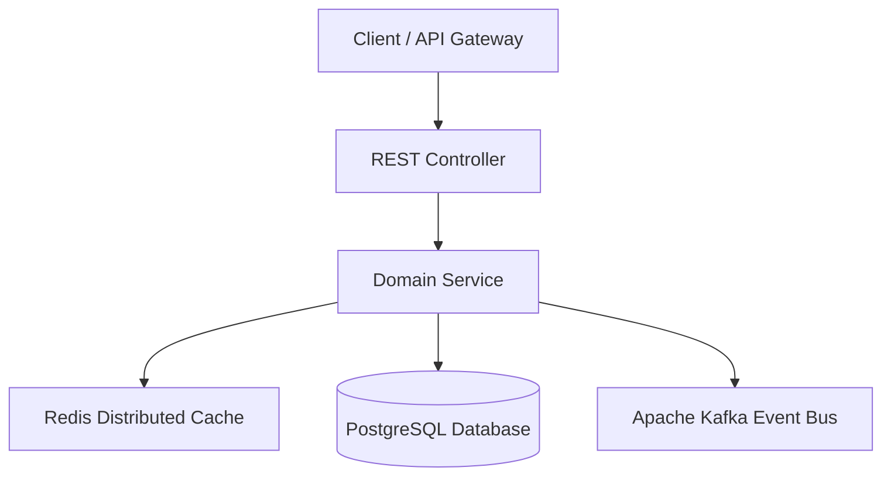

# Project: [Project Title]

---

## 1. Requirements & Scope
### Functional Requirements
- Requirement 1
- Requirement 2

### Non-Functional Requirements
- **Latency**: p99 $< 20\text{ms}$
- **Throughput**: $10,000\text{ req/sec}$
- **Consistency**: Strong consistency for mutations, eventual for telemetry.

---

## 2. System Architecture


---

## 3. API Specification & Data Model
```http
POST /api/v1/resource
Content-Type: application/json

{
  "id": "res_1001",
  "name": "Production Resource"
}
```

---

## 4. Production Implementation
- Java 21 LTS, Spring Boot 3.3.4
- Thread-safety, lock-free mechanics, connection pool bounds, structured logging.

---

## 5. Testing & Quality Verification
- **Fast Tier**: `mvn test` (Mock unit tests)
- **Integration Tier**: `mvn verify -Pintegration` (Testcontainers PostgreSQL/Redis/Kafka)

---

## 6. Failure Modes & Resilience
- Circuit Breaker configuration, rate limiters, fallback responses.
